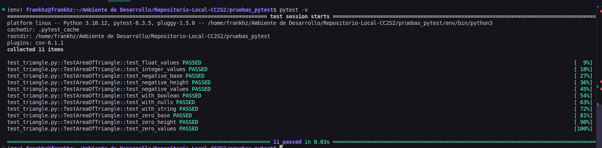

### Actividad: Ejecutar pruebas con pytest

**Paso 1: Instalando pytest y pytest-cov**

Inicio de nuestro workspace


*Ejecutamos el siguiente comando.*

```bash
python3 -m pip install pytest pytest-cov
```

Este comando nos descargará e instalará las últimas versiones de pytest y pytest-cov en nuestro entorno de Python. 


**Paso 2: Escribiendo y ejecutando pruebas con pytest**

*Ejecutamos el siguiente comando.*

```
pytest -v
```

La opción -v activa el modo detallado, mostrándote qué pruebas se ejecutaron y sus resultados. Si las pruebas pasan, verás una salida con texto en verde. Si alguna prueba falla, el texto será rojo.



* Pytest comenzó la ejecución.
* Mostró detalles del entorno (SO, Python, pytest, plugins).
* Indica dónde guarda la caché (`.pytest_cache`) para acelerar futuras ejecuciones y la raíz del proyecto.
* Listó plugins activos incluyendo `cov`que corresponde al `pytest-cov` que instalamos previamente.
* Encontró 11 pruebas.
* Ejecutó cada prueba mostrando su nombre y el resultado (`PASSED`).
* Mostró una barra de avance hasta el 100%.
* Reportó que las 11 pruebas pasaron en 0.88 segundos.

> `pytest` ejecutó exitosamente las 11 pruebas unitarias, mostrando un resultado detallado de cada una.

**Paso 3: Añadiendo cobertura de pruebas con pytest-cov**

*Ejecutamos el siguiente comando.*

```
pytest --cov`
```

Para ejecutar las pruebas y obtener un informe de cobertura de todo los archivos del directorio.


* Pytest comienza la ejecución con la intención de medir la cobertura.
* Se encuentran 11 pruebas en `test_triangle.py`.
* Las 11 pruebas en `test_triangle.py` se ejecutaron y pasaron.
* `pytest-cov` analizó la cobertura de los archivos `.py` encontrados en el directorio actual (`pruebas_pytest`) y sus subdirectorios.
* Se genera un reporte en la terminal mostrando la cobertura por archivo:
    * `test_triangle.py`: 30 declaraciones, 0 perdidas, 100% de cobertura.
    * `triangle.py`: 10 declaraciones, 0 perdidas, 100% de cobertura.
* Se reporta una cobertura total del 100% para las 40 declaraciones combinadas.

> `pytest` ejecutó exitosamente todas las pruebas y `pytest-cov` generó un informe de cobertura que indica que el 100% del código ejecutable en `test_triangle.py` y `triangle.py` fue cubierto por las pruebas.


*Ejecutamos el siguiente comando.*

```
pytest --cov --cov-report=html`
```

Si también deseas generar un informe de cobertura en HTML para visualizarlo.


* De manera similar al ejecutar `pytest --cov` 
* La línea `Coverage HTML written to dir htmlcov` indica que `pytest-cov` generó un informe de cobertura detallado en formato HTML y lo guardó en un nuevo directorio llamado `htmlcov` dentro de tu proyecto.

> `pytest` ejecuta las pruebas, mide la cobertura del código en el proyecto y genera un informe HTML completo.


*Ejecutamos el siguiente comando.*

```
pytest -v --cov=triangle`
```

Si solo deseas medir la cobertura de un módulo específico.


* `pytest` comienza la ejecución en modo detallado (`-v`) y con la intención de medir la cobertura del módulo `triangle`.
* Se encontraron 11 pruebas en `test_triangle.py`.
* Se ejecutaron las 11 pruebas, mostrando el nombre de cada prueba y su estado (`PASSED`).
* `pytest-cov` analizó la cobertura del módulo `triangle.py` durante la ejecución de las pruebas.
* Genera un reporte en la terminal mostrando la cobertura del módulo `triangle`:
    * `triangle.py`: 10 declaraciones, 0 perdidas, 100% de cobertura.
* Reporta una cobertura total del 100% para el módulo `triangle.py`.

> `pytest` ejecutó exitosamente todas las pruebas en modo detallado y `pytest-cov` generó un informe de cobertura que indica que el 100% del código ejecutable en el módulo `triangle.py` fue cubierto por las pruebas.


*Ejecutamos el siguiente comando.*

```
pytest --cov=triangle --cov-report=term-missing`
```

Si deseas un informe más detallado que muestre las líneas que no están cubiertas,


* Pytest comienza la ejecución con la intención de medir la cobertura del módulo `triangle` y mostrar las líneas no cubiertas en la terminal.
* Se encuentran 11 pruebas en `test_triangle.py`.
* Las 11 pruebas en `test_triangle.py` se ejecutaron y pasaron.
* `pytest-cov` analiza la cobertura del módulo `triangle.py`.
* Se genera un reporte en la terminal mostrando:
    * `triangle.py`: 10 declaraciones, 0 perdidas, 100% de cobertura. La columna "Missing" estaría vacía o indicaría que no hay líneas faltantes.
* Se reportó una cobertura total del 100% para el módulo `triangle.py`.

> `pytest` ejecuta exitosamente todas las pruebas y `pytest-cov` generó un informe de cobertura detallado en la terminal para el módulo `triangle.py`, indicando que todas las líneas ejecutables fueron cubiertas por las pruebas. La opción `--cov-report=term-missing` mostraría las líneas faltantes si hubiera alguna.

*Ejecutamos el siguiente comando.*

```
pytest --cov=triangle --cov-report=term-missing --cov-report=html`
```

Si deseas un informe más detallado que muestre las líneas que no están cubiertas,


Ejecución de `pytest --cov=triangle --cov-report=term-missing --cov-report=html`:

* De manera similar al ejecutar `pytest --cov=triangle --cov-report=term-missing` 
* La línea `Coverage HTML written to dir htmlcov` indica que `pytest-cov` también generó un informe de cobertura detallado en formato HTML y lo guardó en el directorio `htmlcov`.

`pytest` ejecuta exitosamente todas las pruebas y `pytest-cov` generó dos tipos de informes de cobertura para el módulo `triangle.py`: uno detallado en la terminal y otro completo en formato HTML para una visualización más interactiva. Ambos indican una cobertura del 100%.

**Paso 4: Añadiendo colores automáticamente**

*Ejecutamos el siguiente comando.*

```
pytest --color=yes
```

Si por alguna razón los colores no se muestran.


