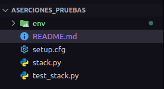
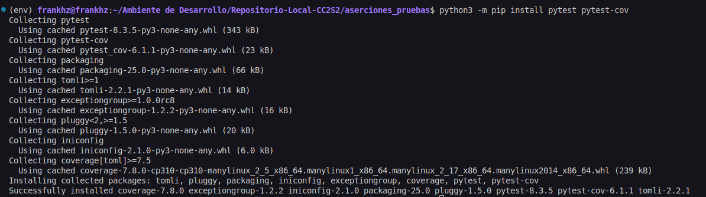
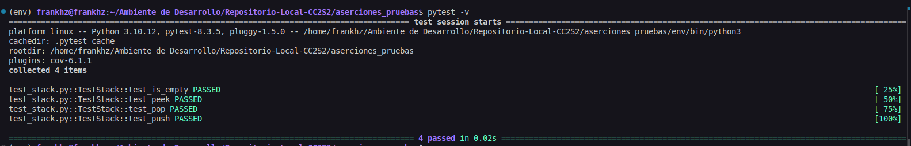
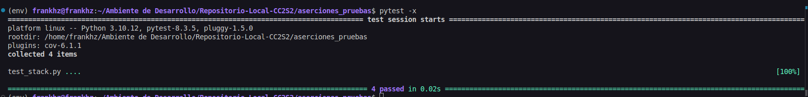
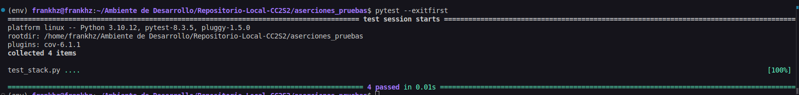
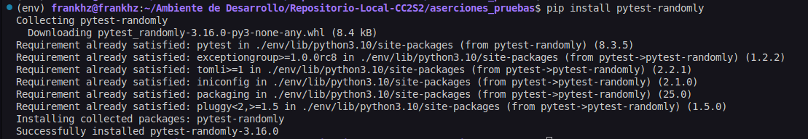
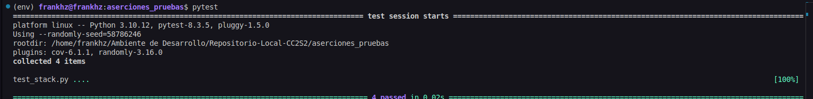
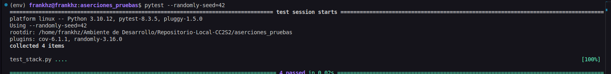

### Actividad: Escribir aserciones en pruebas con pytest

**Paso 1: Instalación de pytest y pytest-cov**

Inicio de nuestro workspace



*Ejecutamos el siguiente comando.*

```bash
python3 -m pip install pytest pytest-cov
```

Este comando nos descargará e instalará las últimas versiones de pytest y pytest-cov en nuestro entorno de Python. 



**Paso 2: Archivos de prueba**

*Ejecutamos el siguiente comando.*

```bash
pytest -v
```



> La ejecución de `pytest -v` completo exitosamente las 4 pruebas unitarias definidas en `test_stack.py` para la implementación de la pila en `stack.py`. Todas las pruebas pasaron, indicando que la implementación de la pila está funcionando correctamente según las aserciones definidas en las pruebas.

*Ejecutamos el siguiente comando.*

```bash
pytest -x
```



*O el siguiente*

```bash
pytest --exitfirst
```



> La ejecución de `pytest --exitfirst` completo todas las 4 pruebas unitarias en `test_stack.py` sin encontrar ningún fallo. Si alguna de las pruebas hubiera fallado, la ejecución se habría detenido inmediatamente después del primer fallo.

*Ejecutamos el siguiente comando.*

```bash
pip install pytest-randomly
```

> Instala el paquete pytest-randomly y sus dependencias para nuestro entorno de Python



*Ejecutamos el siguiente comando.*

```bash
pytest
```



> Vemos que el comportamiento por defecto del plugin una vez instalado 

*Ejecutamos el siguiente comando.*

```bash
pytest --randomly-seed=42
```



> Epecificamos una semilla aleatoria para reproducir un orden específico.
