# **Actividad 4**
## **Actividad:** Introducción a Git - conceptos básicos y operaciones esenciales## **Actividad:** Introducción a Git - conceptos básicos y operaciones esenciales


### Preguntas

1. ¿Cómo te ha ayudado Git a mantener un historial claro y organizado de tus cambios?  

    Git es muy poderoso, funciona basicamente como una maquina del tiempo en donde puedes ir a momentos especificos donde se ha registrado,es decir, tienes el superpoder de **crear** y **controlar** tu propia linea del tiempo de tu repositorio.

2. ¿Qué beneficios ves en el uso de ramas para desarrollar nuevas características o corregir errores?  

    El uso de ramas es una maravilla, pues te permite crear una linea alterna independiente en donde puedes agregar nuevas funciones o corregir errores en lugar de hacerlo en la linea de tiempo principal y asi evitar arriesgarte si algo sale mal.

3. Realiza una revisión final del historial de commits para asegurarte de que todos los cambios se han registrado correctamente.  
    
        git log --oneline
    
    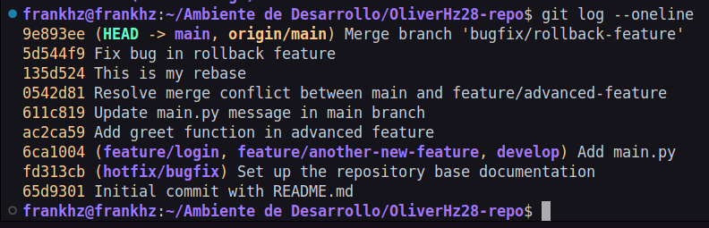


4. Revisa el uso de ramas y merges para ver cómo Git maneja  múltiples líneas de desarrollo.

        $ git log --graph --oneline
    
    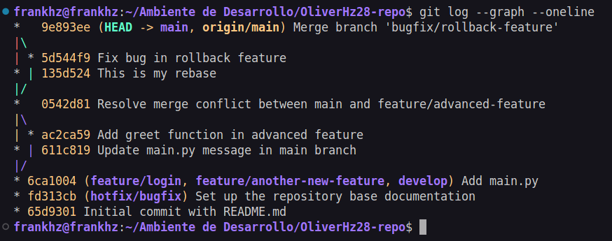

### **Ejercicios**

#### **Ejercicio 4**

1. Hacer cambios en el archivo main.py:
    - Edita el archivo main.py para introducir un nuevo cambio:

        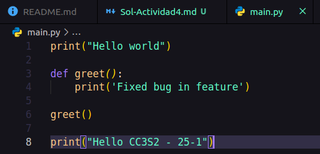

    - Añade y confirma los cambios:

        

2. Usar git reset para deshacer el commit:
    - Deshaz el commit utilizando git reset para volver al estado anterior:

        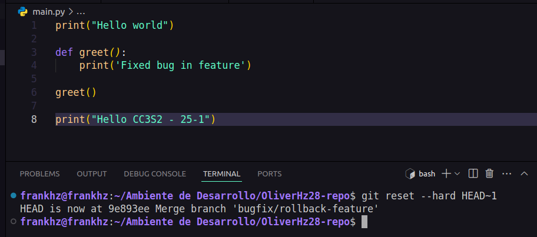

3. Usar git restore para deshacer cambios no confirmados:
    - Realiza un cambio en README.md y no lo confirmes:
        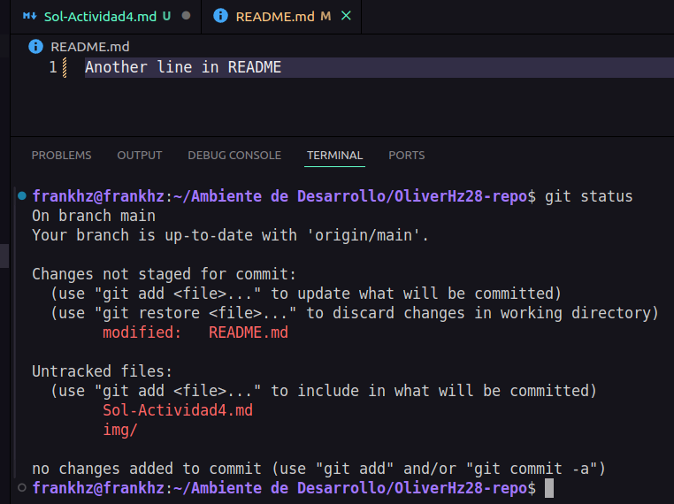

    - Usa git restore para deshacer este cambio no confirmado:
        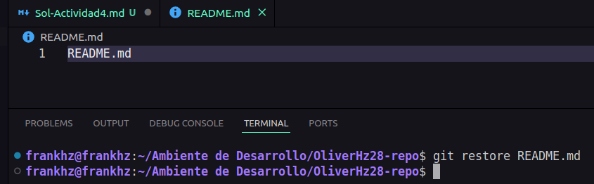    

#### Ejercicio 5: Trabajo colaborativo y manejo de Pull Requests

**Objetivo:** Simular un flujo de trabajo colaborativo utilizando ramas y pull requests.

**Instrucciones:**

0. **Realizar el fork**

    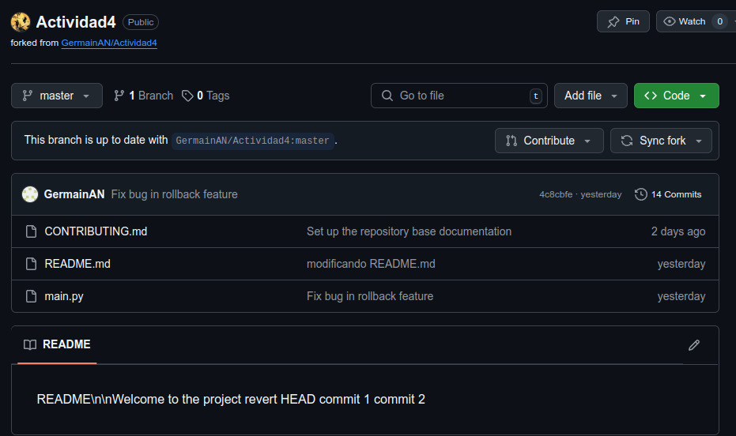


1. **Crear un nuevo repositorio remoto:**
   - Usa GitHub o GitLab para crear un nuevo repositorio remoto y clónalo localmente:

     ```bash
     $ git clone <URL-del-repositorio>
     ```
     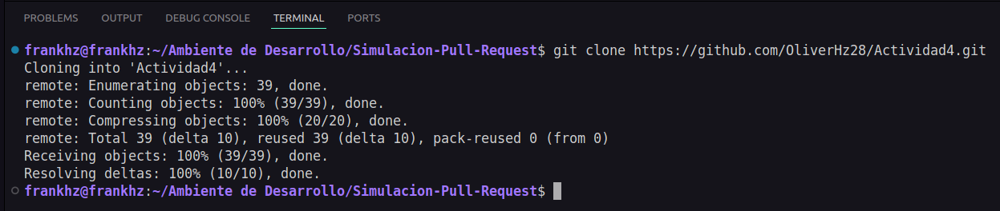


2. **Crear una nueva rama para desarrollo de una característica:**
   - En tu repositorio local, crea una nueva rama `feature/team-feature`:

     ```bash
     $ git branch feature/team-feature
     $ git checkout feature/team-feature
     ```

    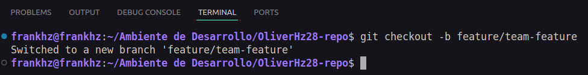


3. **Realizar cambios y enviar la rama al repositorio remoto:**
   - Realiza cambios en los archivos del proyecto y confírmalos:

     ```bash
     $ echo "print('Collaboration is key!')" > collaboration.py
     $ git add .
     $ git commit -m "Add collaboration script"
     ```
   - Envía la rama al repositorio remoto:

     ```bash
     $ git push origin feature/team-feature
     ```

     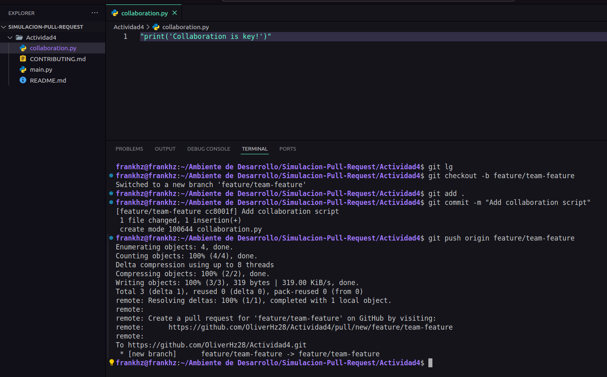

4. **Abrir un Pull Request:**
   - Abre un Pull Request (PR) en la plataforma remota (GitHub/GitLab) para fusionar `feature/team-feature` con la rama `main`.
   - Añade una descripción detallada del PR, explicando los cambios realizados y su propósito.

    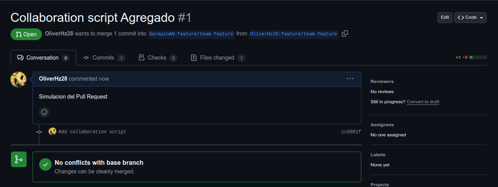


5. **Revisar y fusionar el Pull Request:**
   - Simula la revisión de código, comenta en el PR y realiza cualquier cambio necesario basado en la retroalimentación.
   - Una vez aprobado, fusiona el PR en la rama `main`.

    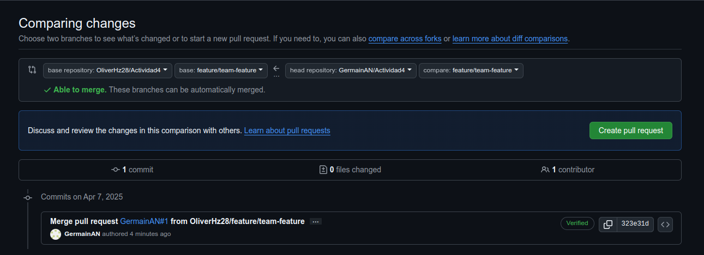

    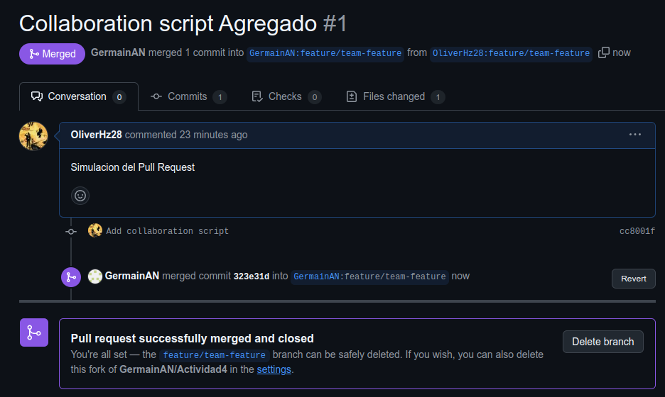


6. **Eliminar la rama remota y local:**
   - Después de la fusión, elimina la rama tanto local como remotamente:

     ```bash
     $ git branch -d feature/team-feature
     $ git push origin --delete feature/team-feature
     ```

     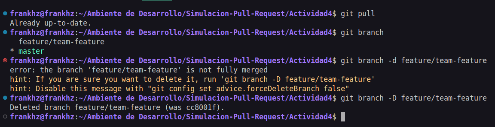
