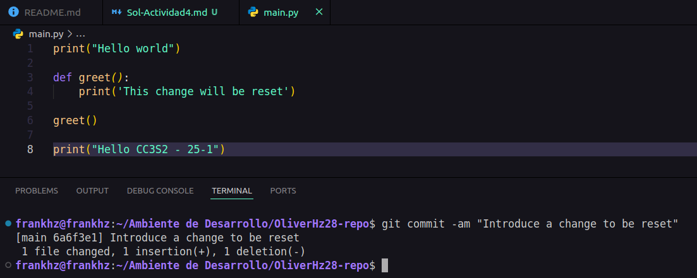

# **Actividad 4**
## **Actividad:** Introducción a Git - conceptos básicos y operaciones esenciales## **Actividad:** Introducción a Git - conceptos básicos y operaciones esenciales

### Preguntas

1. ¿Cómo te ha ayudado Git a mantener un historial claro y organizado de tus cambios?  

    Git es muy poderoso, funciona basicamente como una maquina del tiempo en donde puedes ir a momentos especificos donde se ha registrado,es decir, tienes el superpoder de **crear** y **controlar** tu propia linea del tiempo de tu repositorio.

2. ¿Qué beneficios ves en el uso de ramas para desarrollar nuevas características o corregir errores?  

    El uso de ramas es una maravilla, pues te permite crear una linea alterna independiente en donde puedes agregar nuevas funciones o corregir errores en lugar de hacerlo en la linea de tiempo principal y asi evitar arriesgarte si algo sale mal.

3. Realiza una revisión final del historial de commits para asegurarte de que todos los cambios se han registrado correctamente.  
    
        git log --oneline
    
    

4. Revisa el uso de ramas y merges para ver cómo Git maneja  múltiples líneas de desarrollo.

        $ git log --graph --oneline
    
    

### **Ejercicios**

#### **Ejercicio 4**

1. Hacer cambios en el archivo main.py:
    - Edita el archivo main.py para introducir un nuevo cambio:

        

    - Añade y confirma los cambios:

        

2. Usar git reset para deshacer el commit:
    - Deshaz el commit utilizando git reset para volver al estado anterior:

        

3. Usar git restore para deshacer cambios no confirmados:
    - Realiza un cambio en README.md y no lo confirmes:
        

    - Usa git restore para deshacer este cambio no confirmado:
            

#### **Ejercicio 5**
