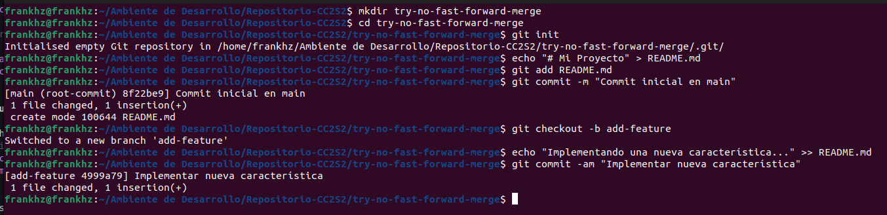

### **Actividad: Explorando diferentes formas de fusionar en Git**

### Ejemplos

#### 1. Fusión Fast-forward (git merge --ff)
La fusión fast-forward es la forma más simple de combinar ramas en Git. Solo es posible cuando la rama base no ha recibido nuevos commits desde que se creó la rama feature.

##### Pasos prácticos:

```bash
# Crear un nuevo repositorio
$ mkdir try-fast-forward-merge
$ cd try-fast-forward-merge
$ git init

# Agregar un archivo inicial en la rama principal (main)
$ echo "# Mi Proyecto" > README.md
$ git add README.md
$ git commit -m "Commit inicial en main"

# Crear y cambiar a una nueva rama 'add-description'
$ git checkout -b add-description

# Hacer cambios en la nueva rama y comitearlos
$ echo "Este proyecto es un ejemplo de cómo usar Git." >> README.md
$ git add README.md
$ git commit -m "Agregar descripción al README.md"
```

**Ejecucion**
    

**Pregunta:** MUestra la estructura de commits resultante.

```bash
# Cambiar de vuelta a la rama 'main' y realizar la fusión fast-forward
$ git checkout main
$ git merge add-description

# Ver el historial lineal
$ git log --graph --oneline
```
**Resultado:** El historial de tu repositorio.    

**Ejecucion de git merge --ff exitosa**
    

#### 2. Fusión No-fast-forward (git merge --no-ff)

La fusión no-fast-forward crea un nuevo commit de fusión. Es útil para preservar el contexto de la fusión, especialmente en equipos donde se requiere más claridad en el historial de cambios.

##### Pasos prácticos:

```bash
# Crear un nuevo repositorio
$ mkdir try-no-fast-forward-merge
$ cd try-no-fast-forward-merge
$ git init

# Agregar un archivo inicial en la rama principal (main)
$ echo "# Mi Proyecto" > README.md
$ git add README.md
$ git commit -m "Commit inicial en main"

# Crear y cambiar a una nueva rama 'add-feature'
$ git checkout -b add-feature

# Hacer cambios en la nueva rama y comitearlos
$ echo "Implementando una nueva característica..." >> README.md
$ git add README.md
$ git commit -m "Implementar nueva característica"
```

**Ejecucion**




**Pregunta:** Muestra el log de commits resultante.

```bash
# Cambiar de vuelta a la rama 'main' y realizar una fusión no-fast-forward
$ git checkout main
$ git merge --no-ff add-feature
```

Después de la edición, veamos el log ahora:

```bash
# Ver el historial
$ git log --graph --oneline
```

El historial de tu repositorio mostrará un commit de fusión.

**Ejecucion de git merge --no-ff exitosa**
    

##### 3. Fusión squash (git merge --squash)

La fusión squash combina todos los cambios de una rama en un solo commit en la rama principal. Este método es útil cuando se quiere mantener un historial de commits limpio.

##### Pasos prácticos:

```bash
# Crear un nuevo repositorio
$ mkdir try-squash-merge
$ cd try-squash-merge
$ git init

# Agregar un archivo inicial en la rama principal (main)
$ echo "# Mi Proyecto" > README.md
$ git add README.md
$ git commit -m "Commit inicial en main"

# Crear y cambiar a una nueva rama 'add-basic-files'
$ git checkout -b add-basic-files

# Hacer algunos cambios y comitearlos
$ echo "# CÓMO CONTRIBUIR" >> CONTRIBUTING.md
$ git add CONTRIBUTING.md
$ git commit -m "Agregar CONTRIBUTING.md"

$ echo "# LICENCIA" >> LICENSE.txt
$ git add LICENSE.txt
$ git commit -m "Agregar LICENSE.txt"
```

**Ejecucion**


**Pregunta:** ¿Cuál es tu estructura de commits?

```bash
# Cambiar de vuelta a la rama 'main' y realizar la fusión squash
$ git checkout main
$ git merge --squash add-basic-files
```

Los commits luego se aplastan y se convierten en un solo commit:

Para completar la fusión squash, realiza un commit:

```bash
$ git add .
$ git commit -m "Agregar documentación estándar del repositorio"
$ git log --graph --oneline
```

Esto combinará todos los cambios de la rama add-multiple-features en un solo nuevo commit en la rama main.

**Ejecucion de git merge --squash exitosa**
    


#### Ejercicios

1. **Clona un repositorio Git con múltiples ramas.**  
   Identifica dos ramas que puedas fusionar utilizando `git merge --ff`.  
   Haz el proceso de fusión utilizando `git merge --ff`.  
   Verifica el historial con `git log --graph --oneline`.  

   

   

   

   **Pregunta:** ¿En qué situaciones recomendarías evitar el uso de `git merge --ff`? Reflexiona sobre las desventajas de este método.

   Sol.

2. **Simula un flujo de trabajo de equipo.**  
   Trabaja en dos ramas independientes, creando diferentes cambios en cada una.  
   Fusiona ambas ramas con `git merge --no-ff` para ver cómo se crean los commits de fusión.  
   Observa el historial utilizando `git log --graph --oneline`.  
   
    

    

    

    


   **Pregunta:** ¿Cuáles son las principales ventajas de utilizar `git merge --no-ff` en un proyecto en equipo? ¿Qué problemas podrían surgir al depender excesivamente de commits de fusión?

    Sol. ---

3. **Crea múltiples commits en una rama.**  
   Haz varios cambios y commits en una rama feature.  
   Fusiona la rama con `git merge --squash` para aplanar todos los commits en uno solo.  
   Verifica el historial de commits antes y después de la fusión para ver la diferencia.  

    

    

    


   **Pregunta:** ¿Cuándo es recomendable utilizar una fusión squash? ¿Qué ventajas ofrece para proyectos grandes en comparación con fusiones estándar?

---

#### Resolver conflictos en una fusión non-fast-forward

En algunos casos, las fusiones no son tan sencillas y pueden surgir conflictos que necesitas resolver manualmente. Este ejercicio te guiará a través del proceso de manejo de conflictos.

1. Inicializa un nuevo repositorio:
   ```bash
   mkdir try-merge-conflict
   cd try-merge-conflict
   git init
   ```

2. Crea un archivo index.html y realiza un commit en la rama main:
   ```bash
   echo "<html><body><h1>Proyecto inicial CC3S2</h1></body></html>" > index.html
   git add index.html
   git commit -m "commit inicial del  index.html en main"
   ```

3. Crea y cambia a una nueva rama feature-update:
   ```bash
   git checkout -b feature-update
   ```

4. Edita el archivo y realiza un commit en la rama feature-update:
   ```bash
   echo "<p>.....</p>" >> index.html
   git add index.html
   git commit -m "Actualiza ..."
   ```

5. Regresa a la rama main y realiza una edición en el mismo archivo:
   ```bash
   git checkout main
   echo "<footer>Contacta aquí example@example.com</footer>" >> index.html
   git add index.html
   git commit -m "....index.html"
   ```

6. Fusiona la rama feature-update con --no-ff y observa el conflicto:
   ```bash
   git merge --no-ff feature-update
   ```

7. Git detectará un conflicto en index.html. Abre el archivo y resuelve el conflicto. Elimina las líneas de conflicto generadas por Git (`<<<<<<<`, `=======`, `>>>>>>>`) y crea la versión final del archivo con ambos cambios:

   ```html
   <html>
     <body>
       <h1>....</h1>
       <p>....</p>
       <footer>...example@example.com</footer>
     </body>
   </html>
   ```

8. Agrega el archivo corregido y completa la fusión:
   ```bash
   git add index.html
   git commit
   ```

9. Verifica el historial para confirmar la fusión y el commit de resolución de conflicto:
   ```bash
   git log --graph --oneline
   ```