# **Actividad:Rebase, Cherry-Pick y CI/CD en un entorno ágil**

## **Parte 1: git rebase para mantener un historial lineal**

1. **Introducción a Rebase:**

   El rebase mueve tus commits a una nueva base, dándote un historial lineal y limpio. En lugar de fusionar ramas y mostrar un "commit de merge", el rebase integra los cambios aplicándolos en la parte superior de otra rama.

   - **Caso de uso**: Simplifica la depuración y facilita la comprensión del historial de commits.

2. **Escenario de ejemplo:**

   1. **Crea un nuevo repositorio Git y dos ramas, main y new-feature:**

      
     
      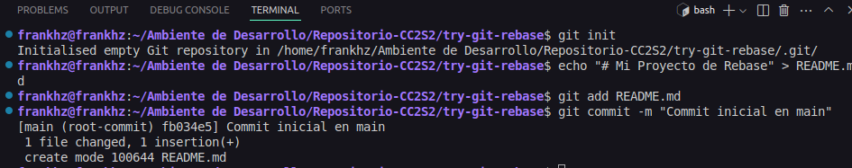

      **Codigo**

        ```bash
        $ mkdir try-git-rebase
        $ cd try-git-rebase
        $ git init
        $ echo "# Mi Proyecto de Rebase" > README.md
        $ git add README.md
        $ git commit -m "Commit inicial en main"
        ```

   2. **Crea y cambia a la rama new-feature:**

        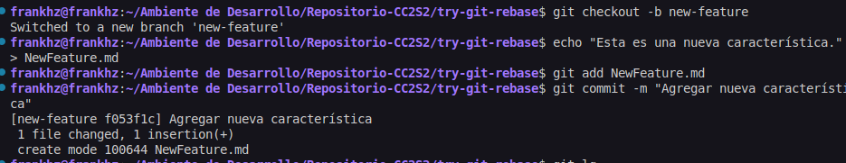

        **Codigo**

        ```bash
        $ git checkout -b new-feature
        $ echo "Esta es una nueva característica." > NewFeature.md
        $ git add NewFeature.md
        $ git commit -m "Agregar nueva característica"
        ```
    **Pregunta:** Presenta el historial de ramas obtenida hasta el momento.

    *Historial Limpio*
     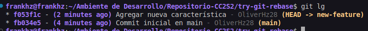

   **Ahora, digamos que se han agregado nuevos commits a main mientras trabajabas en new-feature:**

    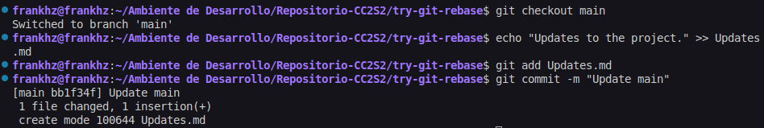

    *Codigo:*
    
   ```bash
   # Cambiar de nuevo a 'main' y agregar nuevos commits
   $ git checkout main
   $ echo "Updates to the project." >> Updates.md
   $ git add Updates.md
   $ git commit -m "Update main"
   ```

   **Tu gráfico de commits ahora diverge (comprueba esto)**

    *Efectivamente, existe una divergencia entre las ramas*
    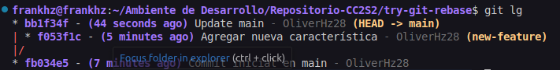

   > **Tarea**: Realiza el rebase de `new-feature` sobre `main` con los siguientes comandos:

    

    *Codigo*

    ```bash
    $ git checkout new-feature
    $ git rebase main
    ```

3. **Revisión:**

   Después de realizar el rebase, visualiza el historial de commits con:
   ```bash
   $ git log --graph –oneline
   ```
    *Visualizacion del historial, se observa un adelantamiento de la rama new-feauture sobre la rama main*. **Podemos decir que esta listo para una fusion limpia**
   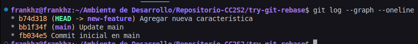

4. **Momento de fusionar y completar el proceso de git rebase:**
   ```bash
   # Cambiar a 'main' y realizar una fusión fast-forward
   $ git checkout main
   $ git merge new-feature
   ```
   *Fusion limpia realizada*
    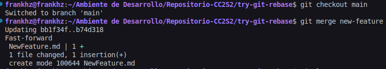

   Cuando se realiza una fusión *fast-forward*, las HEADs de las ramas main y new-feature serán los commits correspondientes.

    **Ambas estan apuntando al mismo commit "niveladas"**
    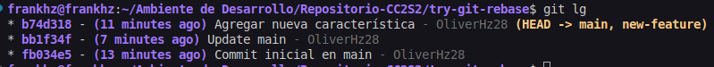

## Parte 2: **git cherry-pick para la integración selectiva de commit**

1. **Introducción a Cherry-pick:**

   `git cherry-pick` te permite seleccionar commits individuales de una rama y aplicarlos en otra. Esto es útil cuando necesitas integrar una característica o corrección sin hacer merge de toda la rama.

   Imagina que tienes dos ramas, main y feature. Te das cuenta de que uno o dos commits de la rama feature deberían moverse a main, pero no estás listo para fusionar toda la rama. El comando `git cherry-pick` te permite hacer precisamente eso.

   Puedes hacer cherry-pick de los cambios de un commit específico en la rama feature y aplicarlos en la rama main.
   Esta acción creará un nuevo commit en la rama main.


2. **Escenario de ejemplo:**

    **Inicializar un nuevo repositorio**

    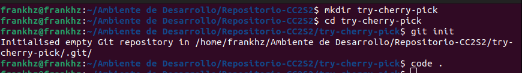

    *Codigo*
    ```bash
    # Inicializar un nuevo repositorio
    $ mkdir try-cherry-pick
    $ cd try-cherry-pick
    $ git init
    ```

    **Agregar y commitear README.md inicial a main**

    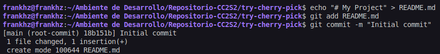

    *Codigo*
    ```bash
    # Agregar y commitear README.md inicial a main
    $ echo "# My Project" > README.md
    $ git add README.md
    $ git commit -m "Initial commit"
    ```

    **Crear y cambiar a una nueva rama, realizar cambios y commitearlos**

    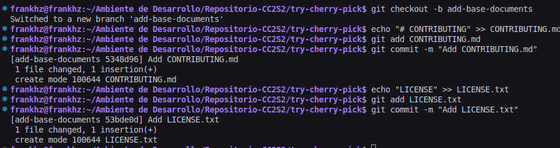

    *Codigo*
    ```bash
    # Crear y cambiar a una nueva rama 'add-base-documents'
    $ git checkout -b add-base-documents

    # Hacer cambios y commitearlos
    # Agregar CONTRIBUTING.md
    $ echo "# CONTRIBUTING" >> CONTRIBUTING.md
    $ git add CONTRIBUTING.md
    $ git commit -m "Add CONTRIBUTING.md"

    # Agregar LICENSE.txt
    $ echo "LICENSE" >> LICENSE.txt
    $ git add LICENSE.txt
    $ git commit -m "Add LICENSE.txt"
    ```

    **Vistazo al log de la rama 'add-base-documents'**

    *Codigo*
     ```bash
    # Echa un vistazo al log de la rama 'add-base-documents'
    $ git log add-base-documents --graph --oneline
   ```

    **Pregunta:** Muestra un diagrama de como se ven las ramas en este paso.

    *Workspace limpio*
    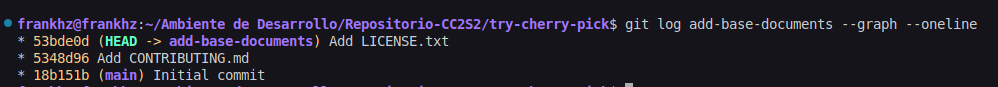

3. **Tarea: Haz cherry-pick de un commit de add-base-documents a main:**

    *Usamos el log para ver el hash reaal*
    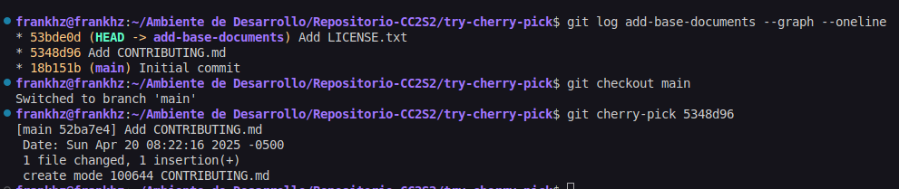

    *Codigo*
    ```bash
    $ git checkout main
    $ git cherry-pick a80e8ad  # Reemplaza con el hash real del commit de tu log
    ```

4. **Revisión:**  
   Revisa el historial nuevamente:

    *Vemos que en el historial de la rama main se agregl el nuevo commit con los cambios del cherry-picked*
    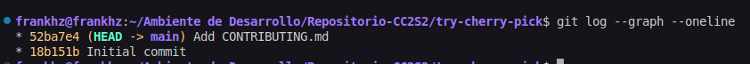

    *Codigo*
   ```bash
   $ git log --graph --oneline
   ```

    **Una mejor visualizacion de todas las ramas**
    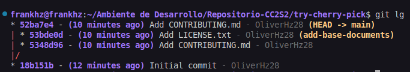

   Después de que hayas realizado con éxito el cherry-pick del commit, se agregará un nuevo commit a tu rama actual (main en este ejemplo) y contendrá los cambios del commit cherry-picked.  

   Ten en cuenta que el nuevo commit tiene los mismos cambios pero un valor de hash de commit diferente. !Comprueba esto!.

### **Preguntas de discusión:**

1. ¿Por qué se considera que rebase es más útil para mantener un historial de proyecto lineal en comparación con merge?  

   > Porque une las historias en una secuencia lineal en lugar de crear un commit como en el merge. Haciendo parecer que el trabajo se realizo de manera secuencial.

2. ¿Qué problemas potenciales podrían surgir si haces rebase en una rama compartida con otros miembros del equipo?  

   Debido a que rebase **reescribe** la historia de esa rama, en donde los commits originales son reemplazados por nuevos commits lo que resultaria perjudicial si otro miembro del equipo ha basado su trabajo en los commits antiguos. Puede llevar a problemas como : 

    - Conflictos confusos y difíciles de resolver, al realizar los pull, git detectara historias divergentes
    - Pérdida de trabajo, si los miembros del equipo intentan fusionar sus ramas locales con la rama rebasada, podrían perder commits o introducir duplicados.

3. ¿En qué se diferencia cherry-pick de merge, y en qué situaciones preferirías uno sobre el otro?  

    En que no se trae consigo todo el historial de la rama de origen, sino solo los cambios introducidos por los commits específicos que nosotros elegimos.

    **Merge** es preferible si estamos seguro que **todo** los cambios en la rama origen estan listos para integrarse. Mientras que **cherry-pick** es util en situacciones donde solo se necesite algunos cambios en particular de una otra rama.

4. ¿Por qué es importante evitar hacer rebase en ramas públicas?

    Porque causa problemas graves para cualquiera que haya clonado o hecho pull de esa rama, ya que sus repositorios locales tendrán un historial diferente al del repositorio remoto rebasado

## **Ejercicios teóricos**

1. **Diferencias entre git merge y git rebase**  
   **Pregunta**: Explica la diferencia entre git merge y git rebase y describe en qué escenarios sería más adecuado utilizar cada uno en un equipo de desarrollo ágil que sigue las prácticas de Scrum.

    | Característica          | Git Merge                                  | Git Rebase                                     |
    | ----------------------- | ------------------------------------------ | ---------------------------------------------- |
    | **Funcionamiento** | Combina historiales creando commit de fusión | Aplica commits sobre otra rama (reescribe historia) |
    | **Historial** | Conserva bifurcaciones y uniones           | Resulta en un historial lineal                |
    | **Uso en Scrum** | Integración final en ramas compartidas      | Limpieza de ramas locales antes de compartir   |
    | **Ramas Públicas** | Seguro                                     | **No usar** |
    | **Escenario Adecuado** | Integrar ramas completadas, preservar historia | Limpiar historial local antes de compartir      |


2. **Relación entre git rebase y DevOps**  
   **Pregunta**: ¿Cómo crees que el uso de git rebase ayuda a mejorar las prácticas de DevOps, especialmente en la implementación continua (CI/CD)? Discute los beneficios de mantener un historial lineal en el contexto de una entrega continua de código y la automatización de pipelines.

    | Beneficio para DevOps/CI/CD             | Porque ...                                                                                                                                                                                                                                                           |
    | :------------------------------------ | :-------------------------------------------------------------------------------------------------------------------------------------------------------------------------------------------------------------------------------------------------------------------- |
    | **Automatización Simplificada** | Los scripts de CI/CD para construir, probar y desplegar código son más fáciles de escribir y mantener con un historial secuencial.                                                                                                                                   |
    | **Seguimiento y Auditoría Directos** | Identificar qué commit se desplegó y rastrear cambios para auditorías o rollbacks es más sencillo sin la complejidad de las ramas de fusión.                                                                                                                            |
    | **Menor Complejidad en Conflictos** | Mantener las ramas de funcionalidad actualizadas con la principal mediante rebase reduce la probabilidad de conflictos grandes y difíciles durante la integración final, aunque el rebase inicial pueda tener conflictos.                                                 |
    | **Despliegues Limpios y Predecibles** | Cada despliegue desde una rama principal con un historial lineal representa una secuencia clara de cambios, lo que facilita la comprensión de la versión en producción y simplifica los rollbacks.                                                                     |

3. **Impacto del git cherry-pick en un equipo Scrum**  
   **Pregunta**: Un equipo Scrum ha finalizado un sprint, pero durante la integración final a la rama principal (main) descubren que solo algunos commits específicos de la rama de una funcionalidad deben aplicarse a producción. ¿Cómo podría ayudar git cherry-pick en este caso? Explica los beneficios y posibles complicaciones.

    | Aspecto             | Git Cherry-pick                                                                 |
    |----------------------|---------------------------------------------------------------------------------                |
    | **Beneficios** | Integración selectiva, flexibilidad en la entrega, mitigación de riesgos.        |
    | **Complicaciones** | Pérdida de contexto, duplicación de commits, problemas de dependencia, dificultad en futuras fusiones, historial confuso. |
    | **Precauciones** | Usar con cuidado, priorizar comunicación y documentación, considerar otras alternativas. |

## **Ejercicios prácticos**

1. **Simulación de un flujo de trabajo Scrum con git rebase y git merge**

   **Contexto:**  
   Tienes una rama `main` y una rama `feature` en la que trabajas. Durante el desarrollo del sprint, se han realizado commits tanto en `main` como en `feature`.  

   Tu objetivo es integrar los cambios de la rama `feature` en `main` manteniendo un historial limpio.

   **Instrucciones:**

   - Crea un repositorio y haz algunos commits en la rama main.
   - Crea una rama feature, agrega nuevos commits, y luego realiza algunos commits adicionales en main.
   - Realiza un rebase de feature sobre main.
   - Finalmente, realiza una fusión fast-forward de feature con main.


   **Comandos:**
   ```bash
   $ mkdir scrum-workflow
   $ cd scrum-workflow
   $ git init
   $ echo "Commit inicial en main" > mainfile.md
   $ git add mainfile.md
   $ git commit -m "Commit inicial en main"

   $ git checkout -b feature
   $ echo "Nueva característica en feature" > featurefile.md
   $ git add featurefile.md
   $ git commit -m "Commit en feature"

   $ git checkout main
   $ echo "Actualización en main" >> mainfile.md
   $ git add mainfile.md
   $ git commit -m "Actualización en main"
    ```
    *Grafico de commits*
    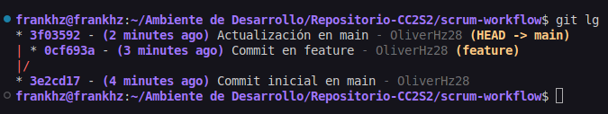

    *Cambio a la rama origen para realizar el merge*
    
    ```bash
    $ git checkout feature
    $ git rebase main
    ```
    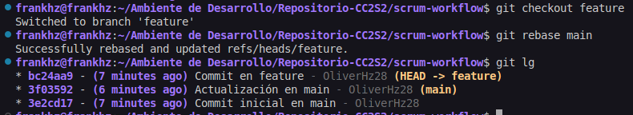

    *Merge realizado*

    ```bash
    $ git checkout main
    $ git merge feature --ff-only
    ```
    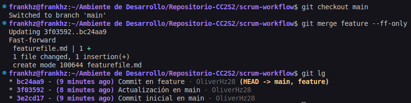

   **Preguntas:**

   - ¿Qué sucede con el historial de commits después del rebase?  

        > Obtenemos un historial secuencial en donde observamos que los commits originales de la rama origen son reemplazados por nuevos commits con el mismo contenido pero diferentes SHA-1 hashes

   - ¿En qué situación aplicarías una fusión fast-forward en un proyecto ágil?

        > Aplicaria una fusion fast-forward cuando la rama feature no ha divergido de la rama principal

2. **Cherry-pick para integración selectiva en un pipeline CI/CD**

   **Contexto:**  
   Durante el desarrollo de una funcionalidad, te das cuenta de que solo ciertos cambios deben ser integrados en la rama de producción, ya que el resto aún está en desarrollo. Para evitar fusionar toda la rama, decides hacer cherry-pick de los commits que ya están listos para producción.

   **Instrucciones:**

   - Crea un repositorio con una rama main y una rama feature.
   - Haz varios commits en la rama feature, pero solo selecciona uno o dos commits específicos que consideres listos para producción.
   - Realiza un cherry-pick de esos commits desde feature a main.
   - Verifica que los commits cherry-picked aparezcan en main.

   **Comandos:**
   ```bash
   $ mkdir ci-cd-workflow
   $ cd ci-cd-workflow
   $ git init
   $ echo "Commit inicial en main" > main.md
   $ git add main.md
   $ git commit -m "Commit inicial en main"

   $ git checkout -b feature
   $ echo "Primera característica" > feature1.md
   $ git add feature1.md
   $ git commit -m "Agregar primera característica"

   $ echo "Segunda característica" > feature2.md
   $ git add feature2.md
   $ git commit -m "Agregar segunda característica"
   ```

    *Grafico de commits*
    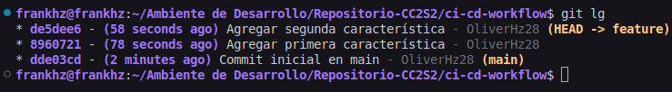


    *Cambio a la rama destino para realizar el cherry-pick*
    ```bash
    $ git checkout main
    $ git cherry-pick <hash_del_commit1>
    $ git cherry-pick <hash_del_commit2>
    ```

    *Observamos una divergencia devido al cherry-pick*
    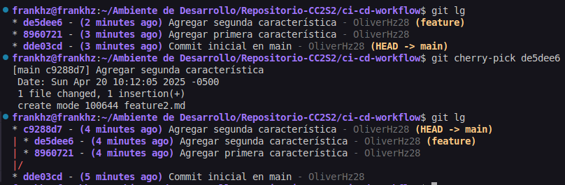


    **Preguntas:**

   - ¿Cómo utilizarías cherry-pick en un pipeline de CI/CD para mover solo ciertos cambios listos a producción?  

        > Se usaria en la rama de producción para integrar solo los commits específicos listos para hacer el build, test y deploy.

   - ¿Qué ventajas ofrece cherry-pick en un flujo de trabajo de DevOps?

        > Permite la entrega selectiva de cambios sin desplegar código incompleto,asi como tambien ofrecer flexibilidad para avanzar ciertos cambios antes que toda una rama de funcionalidad.

---