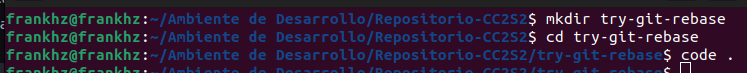
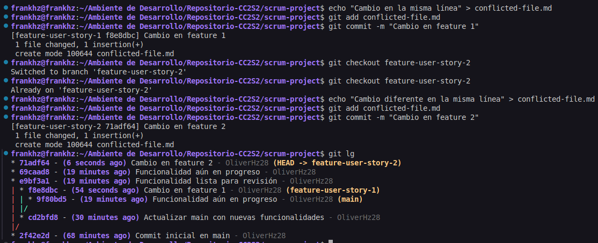

# **Actividad:Rebase, Cherry-Pick y CI/CD en un entorno ágil**

## **Parte 1: git rebase para mantener un historial lineal**

1. **Introducción a Rebase:**

   El rebase mueve tus commits a una nueva base, dándote un historial lineal y limpio. En lugar de fusionar ramas y mostrar un "commit de merge", el rebase integra los cambios aplicándolos en la parte superior de otra rama.

   - **Caso de uso**: Simplifica la depuración y facilita la comprensión del historial de commits.

2. **Escenario de ejemplo:**

   1. **Crea un nuevo repositorio Git y dos ramas, main y new-feature:**

      
     
      

      **Codigo**

        ```bash
        $ mkdir try-git-rebase
        $ cd try-git-rebase
        $ git init
        $ echo "# Mi Proyecto de Rebase" > README.md
        $ git add README.md
        $ git commit -m "Commit inicial en main"
        ```

   2. **Crea y cambia a la rama new-feature:**

        

        **Codigo**

        ```bash
        $ git checkout -b new-feature
        $ echo "Esta es una nueva característica." > NewFeature.md
        $ git add NewFeature.md
        $ git commit -m "Agregar nueva característica"
        ```
    **Pregunta:** Presenta el historial de ramas obtenida hasta el momento.

    *Historial Limpio*
     

   **Ahora, digamos que se han agregado nuevos commits a main mientras trabajabas en new-feature:**

    

    *Codigo:*
    
   ```bash
   # Cambiar de nuevo a 'main' y agregar nuevos commits
   $ git checkout main
   $ echo "Updates to the project." >> Updates.md
   $ git add Updates.md
   $ git commit -m "Update main"
   ```

   **Tu gráfico de commits ahora diverge (comprueba esto)**

    *Efectivamente, existe una divergencia entre las ramas*
    

   > **Tarea**: Realiza el rebase de `new-feature` sobre `main` con los siguientes comandos:

    

    *Codigo*

    ```bash
    $ git checkout new-feature
    $ git rebase main
    ```

3. **Revisión:**

   Después de realizar el rebase, visualiza el historial de commits con:
   ```bash
   $ git log --graph –oneline
   ```
    *Visualizacion del historial, se observa un adelantamiento de la rama new-feauture sobre la rama main*. **Podemos decir que esta listo para una fusion limpia**
   

4. **Momento de fusionar y completar el proceso de git rebase:**
   ```bash
   # Cambiar a 'main' y realizar una fusión fast-forward
   $ git checkout main
   $ git merge new-feature
   ```
   *Fusion limpia realizada*
    

   Cuando se realiza una fusión *fast-forward*, las HEADs de las ramas main y new-feature serán los commits correspondientes.

    **Ambas estan apuntando al mismo commit "niveladas"**
    

## Parte 2: **git cherry-pick para la integración selectiva de commit**

1. **Introducción a Cherry-pick:**

   `git cherry-pick` te permite seleccionar commits individuales de una rama y aplicarlos en otra. Esto es útil cuando necesitas integrar una característica o corrección sin hacer merge de toda la rama.

   Imagina que tienes dos ramas, main y feature. Te das cuenta de que uno o dos commits de la rama feature deberían moverse a main, pero no estás listo para fusionar toda la rama. El comando `git cherry-pick` te permite hacer precisamente eso.

   Puedes hacer cherry-pick de los cambios de un commit específico en la rama feature y aplicarlos en la rama main.
   Esta acción creará un nuevo commit en la rama main.


2. **Escenario de ejemplo:**

    **Inicializar un nuevo repositorio**

    

    *Codigo*
    ```bash
    # Inicializar un nuevo repositorio
    $ mkdir try-cherry-pick
    $ cd try-cherry-pick
    $ git init
    ```

    **Agregar y commitear README.md inicial a main**

    

    *Codigo*
    ```bash
    # Agregar y commitear README.md inicial a main
    $ echo "# My Project" > README.md
    $ git add README.md
    $ git commit -m "Initial commit"
    ```

    **Crear y cambiar a una nueva rama, realizar cambios y commitearlos**

    

    *Codigo*
    ```bash
    # Crear y cambiar a una nueva rama 'add-base-documents'
    $ git checkout -b add-base-documents

    # Hacer cambios y commitearlos
    # Agregar CONTRIBUTING.md
    $ echo "# CONTRIBUTING" >> CONTRIBUTING.md
    $ git add CONTRIBUTING.md
    $ git commit -m "Add CONTRIBUTING.md"

    # Agregar LICENSE.txt
    $ echo "LICENSE" >> LICENSE.txt
    $ git add LICENSE.txt
    $ git commit -m "Add LICENSE.txt"
    ```

    **Vistazo al log de la rama 'add-base-documents'**

    *Codigo*
     ```bash
    # Echa un vistazo al log de la rama 'add-base-documents'
    $ git log add-base-documents --graph --oneline
   ```

    **Pregunta:** Muestra un diagrama de como se ven las ramas en este paso.

    *Workspace limpio*
    

3. **Tarea: Haz cherry-pick de un commit de add-base-documents a main:**

    *Usamos el log para ver el hash reaal*
    

    *Codigo*
    ```bash
    $ git checkout main
    $ git cherry-pick a80e8ad  # Reemplaza con el hash real del commit de tu log
    ```

4. **Revisión:**  
   Revisa el historial nuevamente:

    *Vemos que en el historial de la rama main se agregl el nuevo commit con los cambios del cherry-picked*
    

    *Codigo*
   ```bash
   $ git log --graph --oneline
   ```

    **Una mejor visualizacion de todas las ramas**
    

   Después de que hayas realizado con éxito el cherry-pick del commit, se agregará un nuevo commit a tu rama actual (main en este ejemplo) y contendrá los cambios del commit cherry-picked.  

   Ten en cuenta que el nuevo commit tiene los mismos cambios pero un valor de hash de commit diferente. !Comprueba esto!.

### **Preguntas de discusión:**

1. ¿Por qué se considera que rebase es más útil para mantener un historial de proyecto lineal en comparación con merge?  

   > Porque une las historias en una secuencia lineal en lugar de crear un commit como en el merge. Haciendo parecer que el trabajo se realizo de manera secuencial.

2. ¿Qué problemas potenciales podrían surgir si haces rebase en una rama compartida con otros miembros del equipo?  

   Debido a que rebase **reescribe** la historia de esa rama, en donde los commits originales son reemplazados por nuevos commits lo que resultaria perjudicial si otro miembro del equipo ha basado su trabajo en los commits antiguos. Puede llevar a problemas como : 

    - Conflictos confusos y difíciles de resolver, al realizar los pull, git detectara historias divergentes
    - Pérdida de trabajo, si los miembros del equipo intentan fusionar sus ramas locales con la rama rebasada, podrían perder commits o introducir duplicados.

3. ¿En qué se diferencia cherry-pick de merge, y en qué situaciones preferirías uno sobre el otro?  

    En que no se trae consigo todo el historial de la rama de origen, sino solo los cambios introducidos por los commits específicos que nosotros elegimos.

    **Merge** es preferible si estamos seguro que **todo** los cambios en la rama origen estan listos para integrarse. Mientras que **cherry-pick** es util en situacciones donde solo se necesite algunos cambios en particular de una otra rama.

4. ¿Por qué es importante evitar hacer rebase en ramas públicas?

    Porque causa problemas graves para cualquiera que haya clonado o hecho pull de esa rama, ya que sus repositorios locales tendrán un historial diferente al del repositorio remoto rebasado

## **Ejercicios teóricos**

1. **Diferencias entre git merge y git rebase**  
   **Pregunta**: Explica la diferencia entre git merge y git rebase y describe en qué escenarios sería más adecuado utilizar cada uno en un equipo de desarrollo ágil que sigue las prácticas de Scrum.

    | Característica          | Git Merge                                  | Git Rebase                                     |
    | ----------------------- | ------------------------------------------ | ---------------------------------------------- |
    | **Funcionamiento** | Combina historiales creando commit de fusión | Aplica commits sobre otra rama (reescribe historia) |
    | **Historial** | Conserva bifurcaciones y uniones           | Resulta en un historial lineal                |
    | **Uso en Scrum** | Integración final en ramas compartidas      | Limpieza de ramas locales antes de compartir   |
    | **Ramas Públicas** | Seguro                                     | **No usar** |
    | **Escenario Adecuado** | Integrar ramas completadas, preservar historia | Limpiar historial local antes de compartir      |


2. **Relación entre git rebase y DevOps**  
   **Pregunta**: ¿Cómo crees que el uso de git rebase ayuda a mejorar las prácticas de DevOps, especialmente en la implementación continua (CI/CD)? Discute los beneficios de mantener un historial lineal en el contexto de una entrega continua de código y la automatización de pipelines.

    | Beneficio para DevOps/CI/CD             | Porque ...                                                                                                                                                                                                                                                           |
    | :------------------------------------ | :-------------------------------------------------------------------------------------------------------------------------------------------------------------------------------------------------------------------------------------------------------------------- |
    | **Automatización Simplificada** | Los scripts de CI/CD para construir, probar y desplegar código son más fáciles de escribir y mantener con un historial secuencial.                                                                                                                                   |
    | **Seguimiento y Auditoría Directos** | Identificar qué commit se desplegó y rastrear cambios para auditorías o rollbacks es más sencillo sin la complejidad de las ramas de fusión.                                                                                                                            |
    | **Menor Complejidad en Conflictos** | Mantener las ramas de funcionalidad actualizadas con la principal mediante rebase reduce la probabilidad de conflictos grandes y difíciles durante la integración final, aunque el rebase inicial pueda tener conflictos.                                                 |
    | **Despliegues Limpios y Predecibles** | Cada despliegue desde una rama principal con un historial lineal representa una secuencia clara de cambios, lo que facilita la comprensión de la versión en producción y simplifica los rollbacks.                                                                     |

3. **Impacto del git cherry-pick en un equipo Scrum**  
   **Pregunta**: Un equipo Scrum ha finalizado un sprint, pero durante la integración final a la rama principal (main) descubren que solo algunos commits específicos de la rama de una funcionalidad deben aplicarse a producción. ¿Cómo podría ayudar git cherry-pick en este caso? Explica los beneficios y posibles complicaciones.

    | Aspecto             | Git Cherry-pick                                                                 |
    |----------------------|---------------------------------------------------------------------------------                |
    | **Beneficios** | Integración selectiva, flexibilidad en la entrega, mitigación de riesgos.        |
    | **Complicaciones** | Pérdida de contexto, duplicación de commits, problemas de dependencia, dificultad en futuras fusiones, historial confuso. |
    | **Precauciones** | Usar con cuidado, priorizar comunicación y documentación, considerar otras alternativas. |

## **Ejercicios prácticos**

1. **Simulación de un flujo de trabajo Scrum con git rebase y git merge**

   **Contexto:**  
   Tienes una rama `main` y una rama `feature` en la que trabajas. Durante el desarrollo del sprint, se han realizado commits tanto en `main` como en `feature`.  

   Tu objetivo es integrar los cambios de la rama `feature` en `main` manteniendo un historial limpio.

   **Instrucciones:**

   - Crea un repositorio y haz algunos commits en la rama main.
   - Crea una rama feature, agrega nuevos commits, y luego realiza algunos commits adicionales en main.
   - Realiza un rebase de feature sobre main.
   - Finalmente, realiza una fusión fast-forward de feature con main.


   **Comandos:**
   ```bash
   $ mkdir scrum-workflow
   $ cd scrum-workflow
   $ git init
   $ echo "Commit inicial en main" > mainfile.md
   $ git add mainfile.md
   $ git commit -m "Commit inicial en main"

   $ git checkout -b feature
   $ echo "Nueva característica en feature" > featurefile.md
   $ git add featurefile.md
   $ git commit -m "Commit en feature"

   $ git checkout main
   $ echo "Actualización en main" >> mainfile.md
   $ git add mainfile.md
   $ git commit -m "Actualización en main"
    ```
    *Grafico de commits*
    

    *Cambio a la rama origen para realizar el merge*
    
    ```bash
    $ git checkout feature
    $ git rebase main
    ```
    

    *Merge realizado*

    ```bash
    $ git checkout main
    $ git merge feature --ff-only
    ```
    

   **Preguntas:**

   - ¿Qué sucede con el historial de commits después del rebase?  

        > Obtenemos un historial secuencial en donde observamos que los commits originales de la rama origen son reemplazados por nuevos commits con el mismo contenido pero diferentes SHA-1 hashes

   - ¿En qué situación aplicarías una fusión fast-forward en un proyecto ágil?

        > Aplicaria una fusion fast-forward cuando la rama feature no ha divergido de la rama principal

2. **Cherry-pick para integración selectiva en un pipeline CI/CD**

   **Contexto:**  
   Durante el desarrollo de una funcionalidad, te das cuenta de que solo ciertos cambios deben ser integrados en la rama de producción, ya que el resto aún está en desarrollo. Para evitar fusionar toda la rama, decides hacer cherry-pick de los commits que ya están listos para producción.

   **Instrucciones:**

   - Crea un repositorio con una rama main y una rama feature.
   - Haz varios commits en la rama feature, pero solo selecciona uno o dos commits específicos que consideres listos para producción.
   - Realiza un cherry-pick de esos commits desde feature a main.
   - Verifica que los commits cherry-picked aparezcan en main.

   **Comandos:**
   ```bash
   $ mkdir ci-cd-workflow
   $ cd ci-cd-workflow
   $ git init
   $ echo "Commit inicial en main" > main.md
   $ git add main.md
   $ git commit -m "Commit inicial en main"

   $ git checkout -b feature
   $ echo "Primera característica" > feature1.md
   $ git add feature1.md
   $ git commit -m "Agregar primera característica"

   $ echo "Segunda característica" > feature2.md
   $ git add feature2.md
   $ git commit -m "Agregar segunda característica"
   ```

    *Grafico de commits*
    


    *Cambio a la rama destino para realizar el cherry-pick*
    ```bash
    $ git checkout main
    $ git cherry-pick <hash_del_commit1>
    $ git cherry-pick <hash_del_commit2>
    ```

    *Observamos una divergencia devido al cherry-pick*
    


    **Preguntas:**

   - ¿Cómo utilizarías cherry-pick en un pipeline de CI/CD para mover solo ciertos cambios listos a producción?  

        > Se usaria en la rama de producción para integrar solo los commits específicos listos para hacer el build, test y deploy.

   - ¿Qué ventajas ofrece cherry-pick en un flujo de trabajo de DevOps?

        > Permite la entrega selectiva de cambios sin desplegar código incompleto,asi como tambien ofrecer flexibilidad para avanzar ciertos cambios antes que toda una rama de funcionalidad.
---

### **Git, Scrum y Sprints**

#### **Fase 1: Planificación del sprint (sprint planning)**

**Ejercicio 1: Crear ramas de funcionalidades (feature branches)**

En esta fase del sprint, los equipos Scrum deciden qué historias de usuario van a trabajar. Cada historia de usuario puede representarse como una rama de funcionalidad.

**Objetivo:** Crear ramas para cada historia de usuario y asegurar que el trabajo se mantenga aislado.

**Instrucciones:**

1. Crea un repositorio en Git.
2. Crea una rama `main` donde estará el código base.
3. Crea una rama por cada historia de usuario asignada al sprint, partiendo de la rama `main`.

*Inicio - Todos apuntan al mismo commit*


**Comandos:**
```bash
$ mkdir scrum-project
$ cd scrum-project
$ git init
$ echo "# Proyecto Scrum" > README.md
$ git add README.md
$ git commit -m "Commit inicial en main"

# Crear ramas de historias de usuario
$ git checkout -b feature-user-story-1
$ git checkout -b feature-user-story-2
```

**Pregunta:** ¿Por qué es importante trabajar en ramas de funcionalidades separadas durante un sprint?

> Nos permite un aislar los cambios, menos conflictos, la rama principal es mas estable, trabajo paralelo de cada desarrollador y es de fácil reversión.


#### **Fase 2: Desarrollo del sprint (sprint execution)**

**Ejercicio 2: Integración continua con git rebase**

A medida que los desarrolladores trabajan en sus respectivas historias de usuario, pueden ocurrir cambios en main. Para mantener un historial lineal y evitar conflictos más adelante, se usa `git rebase` para integrar los últimos cambios de main en las ramas de funcionalidad antes de finalizar el sprint.

**Objetivo:** Mantener el código de la rama de funcionalidad actualizado con los últimos cambios de main durante el sprint.

**Instrucciones:**

1. Haz algunos commits en main.
2. Realiza un rebase de la rama `feature-user-story-1` para actualizar su base con los últimos cambios de main.

*Inicio - Todos apuntan al mismo commit*


Se observa que las ramas feature apuntan al primer commit, mientras que el main esta adelantado.

**Comandos:**
```bash
# Simula cambios en la rama main
$ git checkout main
$ echo "Actualización en main" > updates.md
$ git add updates.md
$ git commit -m "Actualizar main con nuevas funcionalidades"
```
*Realizamos el rebase* 


En este caso la rama feature-user-story-1 apunta al commit del main.*

**Comandos**
```bash
# Rebase de la rama feature-user-story-1 sobre main
$ git checkout feature-user-story-1
$ git rebase main
```

**Pregunta:** ¿Qué ventajas proporciona el rebase durante el desarrollo de un sprint en términos de integración continua?

> Nos proporciona un historial limpio y lineal en la rama de integración, facilitando la automatización de pipelines CI/CD,nos simplifica el seguimiento de cambios y reduce la complejidad en la resolución de conflictos durante la integración final.

#### **Fase 3: Revisión del sprint (sprint review)**

**Ejercicio 3: Integración selectiva con git cherry-pick**

En esta fase, es posible que algunas funcionalidades estén listas para ser mostradas a los stakeholders, pero otras aún no están completamente implementadas. Usar `git cherry-pick` puede permitirte seleccionar commits específicos para mostrar las funcionalidades listas, sin hacer merge de ramas incompletas.

**Objetivo:** Mover commits seleccionados de una rama de funcionalidad (`feature-user-story-2`) a `main` sin integrar todos los cambios.

**Instrucciones:**

1. Realiza algunos commits en `feature-user-story-2`.
2. Haz cherry-pick de los commits que estén listos para mostrarse a los stakeholders durante la revisión del sprint.

*Commits agregados en la rama `feature-user-story-2`*


La rama `feature-user-story-2` se adelantan en la linea del tiempo.

**Comandos:**
```bash
$ git checkout feature-user-story-2
$ echo "Funcionalidad lista" > feature2.md
$ git add feature2.md
$ git commit -m "Funcionalidad lista para revisión"

$ echo "Funcionalidad en progreso" > progress.md
$ git add progress.md
$ git commit -m "Funcionalidad aún en progreso"
```

*Cherry-pick del commit `69caad8` de la rama `feature-user-story-2` hacia el `main`*


El commit fue traido al main con un nuevo HASH dando a entender que es un nuevo commit pero con los mismo cambios que el commit real `69caad8`

**Comandos:**
```bash
# Ahora selecciona solo el commit que esté listo
$ git checkout main
$ git cherry-pick <hash_del_commit_de_feature-lista>
```

**Pregunta:** ¿Cómo ayuda `git cherry-pick` a mostrar avances de forma selectiva en un sprint review?

> Nos permite traer commits específicos listos para mostrar los avances sin la necesidad de desplegar toda la rama de funcionalidad, es decir, se enfoca en lo que esta completado y funcional.

#### **Fase 4: Retrospectiva del sprint (sprint retrospective)**

**Ejercicio 4: Revisión de conflictos y resolución**

Durante un sprint, pueden surgir conflictos al intentar integrar diferentes ramas de funcionalidades. Es importante aprender cómo resolver estos conflictos y discutirlos en la retrospectiva.

**Objetivo:** Identificar y resolver conflictos de fusión con `git merge` al intentar integrar varias ramas de funcionalidades al final del sprint.

**Instrucciones:**

1. Realiza cambios en `feature-user-story-1` y `feature-user-story-2` que resulten en conflictos.
2. Intenta hacer merge de ambas ramas con main y resuelve los conflictos.

*Agregamos a cada rama un archivo `conflicted-file.md` con diferente contenido, de tal manera que crearemos un conflicto al realizar el merge en el `main`*



**Comandos:**
```bash
$ git checkout feature-user-story-1
$ echo "Cambio en la misma línea" > conflicted-file.md
$ git add conflicted-file.md
$ git commit -m "Cambio en feature 1"

$ git checkout feature-user-story-2
$ echo "Cambio diferente en la misma línea" > conflicted-file.md
$ git add conflicted-file.md
$ git commit -m "Cambio en feature 2"
```

*Merge exito de la rama `feature-user-story-1`*


**Comandos:**
```bash
# Intentar hacer merge en main
$ git checkout main
$ git merge feature-user-story-1
```

*Aparece el conflicto*


Realizamos el merge, dandonos un conflico por solucionar

**Comandos:**
```bash
$ git merge feature-user-story-2
```


Con ayuda de VisualStudio Code resolveremos el conflicto


Conflicto solucionado, realizamos el commit respectivo para terminar el merge.


**Pregunta**: ¿Cómo manejas los conflictos de fusión al final de un sprint? ¿Cómo puede el equipo mejorar la comunicación para evitar conflictos grandes?

> De manera manual editamos los archivos conflictivos, eligiendo qué cambios conservar y luego commitear la resolución.

> Se puede evitar con una comunicación frecuente sobre los cambios en curso, realizando una integracion continua de manera que los conflictos sean pequeños a comparacion de los grandes.


#### **Fase 5: Fase de desarrollo, automatización de integración continua (CI) con git rebase**

**Ejercicio 5: Automatización de rebase con hooks de Git**

En un entorno CI, es común automatizar ciertas operaciones de Git para asegurar que el código se mantenga limpio antes de que pase a la siguiente fase del pipeline. Usa los hooks de Git para automatizar el rebase cada vez que se haga un push a una rama de funcionalidad.

**Objetivo:** Implementar un hook que haga automáticamente un rebase de `main` antes de hacer push en una rama de funcionalidad, asegurando que el historial se mantenga limpio.

**Instrucciones:**

1. Configura un hook `pre-push` que haga un rebase automático de la rama `main` sobre la rama de funcionalidad antes de que el push sea exitoso.
2. Prueba el hook haciendo push de algunos cambios en la rama `feature-user-story-1`.

*Creando el hook*


**Comandos:**
```bash
# Dentro de tu proyecto, crea un hook pre-push
$ nano .git/hooks/pre-push

# Agrega el siguiente script para automatizar el rebase
#!/bin/bash
git fetch origin main
git rebase origin/main

# Haz el archivo ejecutable
$ chmod +x .git/hooks/pre-push
```

Simulando el push


**Comandos:**
```bash
# Simula cambios y haz push
$ git checkout feature-user-story-1
$ echo "Cambios importantes" > feature1.md
$ git add feature1.md
$ git commit -m "Cambios importantes en feature 1"
$ git push origin feature-user-story-1
```

**Pregunta**: ¿Qué ventajas y desventajas observas al automatizar el rebase en un entorno de CI/CD?

> **Ventajas:** Presenta el historial principal lineal y una menor probabilidad de conflictos grandes en la fusión final.

> **Desventajas:** La reescritura del historial es compartida, puede presentar posible pérdidas de información de ramas, una mayor complejidad en la configuración y resolución de conflictos automatizada.
---


### **Navegando conflictos y versionado en un entorno devOps**

**Objetivo:**  
Gestionar conflictos en Git, realizar fusiones complejas, utilizar herramientas para comparar y resolver conflictos, aplicar buenas prácticas en el manejo del historial de versiones  y usar el versionado semántico en un entorno de integración continua (CI).

**Herramientas:**

- Git  
- Un entorno de desarrollo (Visual Studio Code, terminal, etc.)  
- Un repositorio en GitHub o GitLab (opcional, puede ser local)

**Contexto:**  
En un entorno de desarrollo colaborativo, los conflictos son inevitables cuando varios desarrolladores trabajan en la misma base de código. Resolver estos conflictos es crucial para mantener un flujo de trabajo eficiente en DevOps.

Los conflictos ocurren cuando dos ramas modifican la misma línea de un archivo y luego se intenta fusionarlas. Git no puede decidir qué cambio priorizar, por lo que la resolución manual es necesaria.


#### **Cómo fusionar conflictos en Git:**

1. **Identificar conflictos**: Usa `git status` para ver los archivos en conflicto.
2. **Examinar los archivos**: Busca los marcadores de conflicto (`<<<<<<<`, `=======`, `>>>>>>`) en los archivos.
3. **Resolver los conflictos**: Elige qué cambios conservar (rama actual o fusionada) o mezcla ambos.
4. **Commit de los archivos resueltos**: Después de resolver, añade los archivos al staging y realiza el commit.

#### **Comandos para resolver conflictos**

- `git checkout --ours <file-path>`: Conserva los cambios de tu rama.  
- `git checkout --theirs <file-path>`: Conserva los cambios de la rama fusionada.


#### **Herramientas para gestionar fusiones**

- `git diff`: Compara las diferencias entre dos ramas o commits, ayudando a identificar conflictos:
  ```bash
  $ git diff feature-branch..main
  ```

- `git merge --no-commit --no-ff`: Simula una fusión sin realizar el commit para ver los cambios:
  ```bash
  $ git merge --no-commit --no-ff feature-branch
  $ git diff --cached
  ```
  Si no es lo que esperas, puedes abortar la fusión:
  ```bash
  $ git merge --abort
  ```

- `git mergetool`: Usa herramientas gráficas para resolver conflictos de manera visual. Configura tu herramienta preferida:
  ```bash
  $ git config --global merge.tool vimdiff
  $ git mergetool
  ```

##### **Comandos para organizar tu entorno de trabajo**

- **git reset**: Este comando permite retroceder en el historial de commits. Existen tres tipos:

  1. **Soft Reset**: Mueve el HEAD sin cambiar los archivos:
     ```bash
     $ git reset --soft <commit>
     ```
  2. **Mixed Reset**: Mueve el HEAD y quita archivos del staging, pero mantiene los cambios:
     ```bash
     $ git reset --mixed <commit>
     ```
  3. **Hard Reset**: Elimina todos los cambios no guardados y resetea el directorio de trabajo:
     ```bash
     $ git reset --hard <commit>
     ```

- **git revert**: Deshace cambios sin modificar el historial de commits, creando un nuevo commit:
  ```bash
  $ git revert <commit_hash>
  ```

- **git checkout**: Además de cambiar de ramas, este comando te permite restaurar archivos específicos:
  ```bash
  $ git checkout -- <file_name>
  ```

##### **Herramientas para depurar**

- **git blame**: Muestra qué usuario hizo cambios en una línea específica de un archivo:
  ```bash
  $ git blame file.txt
  ```

- **git bisect**: Realiza una búsqueda binaria para encontrar el commit que introdujo un error:
  ```bash
  $ git bisect start
  $ git bisect bad
  $ git bisect good <commit>
  $ git bisect reset
  ```


##### **git clean y stash**

1. `git clean`: Elimina archivos y directorios no rastreados.
   ```bash
   $ git clean -fd
   ```

2. `git stash`: Guarda cambios sin hacer commit, útil para multitasking.
   ```bash
   $ git stash
   $ git stash apply stash@{0}
   ```

##### **.gitignore**

El archivo `.gitignore` te permite especificar qué archivos y carpetas deben ignorarse durante un `git add`, asegurando que permanezcan exclusivos de tu entorno local.

```bash
# Ignorar todos los archivos de log
.log

# Ignorar archivos de configuración personal
config/personal/
```

##### **Versioning en Git**

Usa versioning semántico para gestionar versiones del software de manera clara:
```bash
$ git tag -a v1.0 -m "Initial stable release"
$ git tag v2.4.4 <commit>
```

---

#### **Ejemplo:**

1. **Inicialización del proyecto y creación de ramas**

   - **Paso 1**: Crea un nuevo proyecto en tu máquina local.
     ```bash
     $ mkdir proyecto-colaborativo
     $ cd proyecto-colaborativo
     ```
   - **Paso 2**: Inicializa Git en tu proyecto.
     ```bash
     $ git init
     ```
   - **Paso 3**: Crea un archivo de texto llamado `archivo_colaborativo.txt` y agrega algún contenido inicial.
     ```bash
     $ echo "Este es el contenido inicial del proyecto" > archivo_colaborativo.txt
     ```
   - **Paso 4**: Agrega el archivo al área de staging y haz el primer commit.
     ```bash
     $ git add .
     $ git commit -m "Commit inicial con contenido base"
     ```
   - **Paso 5**: Crea dos ramas activas: main y feature-branch.
     ```bash
     $ git branch feature-branch  # Crear una nueva rama
     ```
   - **Paso 6**: Haz checkout a la rama feature-branch y realiza un cambio en el archivo `archivo_colaborativo.txt`.
     ```bash
     $ git checkout feature-branch
     $ echo "Este es un cambio en la feature-branch" >> archivo_colaborativo.txt
     $ git add .
     $ git commit -m "Cambios en feature-branch"
     ```
   - **Paso 7**: Regresa a la rama main y realiza otro cambio en la misma línea del archivo `archivo_colaborativo.txt`.
     ```bash
     $ git checkout main
     $ echo "Este es un cambio en la rama main" >> archivo_colaborativo.txt
     $ git add .
     $ git commit -m "Cambios en main"
     ```

    Hemos generado cambios en la rama `feature-branch` en el  `archivo_colaborativo.txt` de tal manera que nos generara conflicto al realizar el merge en la main ya que este posee tambien el `archivo_colaborativo.txt` sin modificar.

    *Grafico de las ramas*

     

2. **Fusión y resolución de conflictos**

   - **Paso 1**: Intenta fusionar feature-branch en main. Se espera que surjan conflictos de fusión.
     ```bash
     $ git merge feature-branch
     ```
   - **Paso 2**: Usa `git status` para identificar los archivos en conflicto. Examina los archivos afectados y resuelve manualmente los conflictos, conservando las líneas de código más relevantes para el proyecto.
     ```bash
     $ git status
     $ git checkout --theirs <archivo>  # Si decides aceptar los cambios de feature-branch
     $ git checkout --ours <archivo>    # Si decides aceptar los cambios de main
     ```

   - **Paso 3**: Una vez resueltos los conflictos, commitea los archivos y termina la fusión
     ```bash
     $ git add .
     $ git commit -m "Conflictos resueltos"
     ```

     Realizamos el merge, en la cual nos salio un conflicto como esperabamos. Resolvimos el conflico aceptando los cambios de la rama `feature-branch`
     
     

     *Visualizacion de las ramas despues de resolver el conflicto del merge*

     

3. **Simulación de fusiones y uso de git diff**

   - **Paso 1**: Simula una fusión usando `git merge --no-commit --no-ff` para ver cómo se comportarían los cambios antes de realizar el commit.

    Realizamos algunas modificaciones para que nos permita simular el `merge --no-comit --no-ff`

    

    *Grafico de las ramas *

    

     ```bash
     $ git merge --no-commit --no-ff feature-branch
     $ git diff --cached  # Ver los cambios en el área de staging
     $ git merge --abort  # Abortar la fusión si no es lo que se esperaba
     ```
    Simulacion del `merge --no-comit --no-ff`

         

    Abortamos la fusion pues no era lo que requeriamos

4. **Uso de git mergetool**

   - **Paso 1**: Configura git mergetool con una herramienta de fusión visual (puedes usar meld, vimdiff, o Visual Studio Code).
     ```bash
     $ git config --global merge.tool <nombre-herramienta>
     $ git mergetool
     ```
   - **Paso 2**: Usa la herramienta gráfica para resolver un conflicto de fusión.

5. **Uso de git revert y git reset**

   - **Paso 1**: Simula la necesidad de revertir un commit en main debido a un error. Usa `git revert` para crear un commit que deshaga los cambios.

     *Codigo*
     ```bash
     $ git revert <commit_hash>
     ```

     *Realizamos el revert*

     

     Se revierte los archivos al estado del commit `c5ea6a4` añadiendo un nuevo commit.

   - **Paso 2**: Realiza una prueba con `git reset --mixed` para entender cómo reestructurar el historial de commits sin perder los cambios no commiteados.

     *Codigo*
     ```bash
     $ git reset --mixed <commit_hash>
     ```

     *Realizamos el mixed*

     

     *Agregamos al staged y realizamos el commit respectivo*

     

     Observamos que nos ubico al punto del commit `c5ea6a4` pero con nuestros cambios sin commitear y realizo un nuevo commit.

6. **Versionado semántico y etiquetado**

   - **Paso 1**: Aplica versionado semántico al proyecto utilizando tags para marcar versiones importantes.
     ```bash
     $ git tag -a v1.0.0 -m "Primera versión estable"
     $ git push origin v1.0.0
     ```
    *Grafico de las ramas*

     

     Observamos una etiqueta `tag -a v1.0.0` en la donde apuntaba el HEAD en nuestro en el main. Ya que deberia ser la version mas importante

7. **Aplicación de git bisect para depuración**

   - **Paso 1**: Usa `git bisect` para identificar el commit que introdujo un error en el código.
     ```bash
     $ git bisect start
     $ git bisect bad   # Indica que la versión actual tiene un error
     $ git bisect good <último_commit_bueno>
     # Continúa marcando como "good" o "bad" hasta encontrar el commit que introdujo el error
     $ git bisect reset  # Salir del modo bisect
     ```

    *Practicando con el bisect*
    


8. **Documentación y reflexión**

   - **Paso 1**: Documenta todos los comandos usados y los resultados obtenidos en cada paso.
   - **Paso 2**: Reflexiona sobre la utilidad de cada comando en un flujo de trabajo de DevOps.
