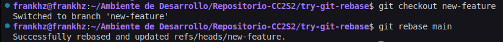

# **Actividad:Rebase, Cherry-Pick y CI/CD en un entorno ágil**

## **Parte 1: git rebase para mantener un historial lineal**

1. **Introducción a Rebase:**

   El rebase mueve tus commits a una nueva base, dándote un historial lineal y limpio. En lugar de fusionar ramas y mostrar un "commit de merge", el rebase integra los cambios aplicándolos en la parte superior de otra rama.

   - **Caso de uso**: Simplifica la depuración y facilita la comprensión del historial de commits.

2. **Escenario de ejemplo:**

   1. **Crea un nuevo repositorio Git y dos ramas, main y new-feature:**

      
     
      

      **Codigo**

        ```bash
        $ mkdir try-git-rebase
        $ cd try-git-rebase
        $ git init
        $ echo "# Mi Proyecto de Rebase" > README.md
        $ git add README.md
        $ git commit -m "Commit inicial en main"
        ```

   2. **Crea y cambia a la rama new-feature:**

        

        **Codigo**

        ```bash
        $ git checkout -b new-feature
        $ echo "Esta es una nueva característica." > NewFeature.md
        $ git add NewFeature.md
        $ git commit -m "Agregar nueva característica"
        ```
    **Pregunta:** Presenta el historial de ramas obtenida hasta el momento.

    *Historial Limpio*
     

   **Ahora, digamos que se han agregado nuevos commits a main mientras trabajabas en new-feature:**

    

    *Codigo:*
    
   ```bash
   # Cambiar de nuevo a 'main' y agregar nuevos commits
   $ git checkout main
   $ echo "Updates to the project." >> Updates.md
   $ git add Updates.md
   $ git commit -m "Update main"
   ```

   **Tu gráfico de commits ahora diverge (comprueba esto)**

    *Efectivamente, existe una divergencia entre las ramas*
    

   > **Tarea**: Realiza el rebase de `new-feature` sobre `main` con los siguientes comandos:

    

    *Codigo*

    ```bash
    $ git checkout new-feature
    $ git rebase main
    ```

3. **Revisión:**

   Después de realizar el rebase, visualiza el historial de commits con:
   ```bash
   $ git log --graph –oneline
   ```
    *Visualizacion del historial, se observa un adelantamiento de la rama new-feauture sobre la rama main*. **Podemos decir que esta listo para una fusion limpia**
   

4. **Momento de fusionar y completar el proceso de git rebase:**
   ```bash
   # Cambiar a 'main' y realizar una fusión fast-forward
   $ git checkout main
   $ git merge new-feature
   ```
   *Fusion limpia realizada*
    

   Cuando se realiza una fusión *fast-forward*, las HEADs de las ramas main y new-feature serán los commits correspondientes.

    **Ambas estan apuntando al mismo commit "niveladas"**
    

## Parte 2: **git cherry-pick para la integración selectiva de commit**

1. **Introducción a Cherry-pick:**

   `git cherry-pick` te permite seleccionar commits individuales de una rama y aplicarlos en otra. Esto es útil cuando necesitas integrar una característica o corrección sin hacer merge de toda la rama.

   Imagina que tienes dos ramas, main y feature. Te das cuenta de que uno o dos commits de la rama feature deberían moverse a main, pero no estás listo para fusionar toda la rama. El comando `git cherry-pick` te permite hacer precisamente eso.

   Puedes hacer cherry-pick de los cambios de un commit específico en la rama feature y aplicarlos en la rama main.
   Esta acción creará un nuevo commit en la rama main.


2. **Escenario de ejemplo:**

    **Inicializar un nuevo repositorio**

    

    *Codigo*
    ```bash
    # Inicializar un nuevo repositorio
    $ mkdir try-cherry-pick
    $ cd try-cherry-pick
    $ git init
    ```

    **Agregar y commitear README.md inicial a main**

    

    *Codigo*
    ```bash
    # Agregar y commitear README.md inicial a main
    $ echo "# My Project" > README.md
    $ git add README.md
    $ git commit -m "Initial commit"
    ```

    **Crear y cambiar a una nueva rama, realizar cambios y commitearlos**

    

    *Codigo*
    ```bash
    # Crear y cambiar a una nueva rama 'add-base-documents'
    $ git checkout -b add-base-documents

    # Hacer cambios y commitearlos
    # Agregar CONTRIBUTING.md
    $ echo "# CONTRIBUTING" >> CONTRIBUTING.md
    $ git add CONTRIBUTING.md
    $ git commit -m "Add CONTRIBUTING.md"

    # Agregar LICENSE.txt
    $ echo "LICENSE" >> LICENSE.txt
    $ git add LICENSE.txt
    $ git commit -m "Add LICENSE.txt"
    ```

    **Vistazo al log de la rama 'add-base-documents'**

    
     ```bash
    # Echa un vistazo al log de la rama 'add-base-documents'
    $ git log add-base-documents --graph --oneline
   ```

    **Pregunta:** Muestra un diagrama de como se ven las ramas en este paso.


3. **Tarea: Haz cherry-pick de un commit de add-base-documents a main:**
   ```bash
   $ git checkout main
   $ git cherry-pick a80e8ad  # Reemplaza con el hash real del commit de tu log
   ```

4. **Revisión:**  
   Revisa el historial nuevamente:
   ```bash
   $ git log --graph --oneline
   ```
   Después de que hayas realizado con éxito el cherry-pick del commit, se agregará un nuevo commit a tu rama actual (main en este ejemplo) y contendrá los cambios del commit cherry-picked.  

   Ten en cuenta que el nuevo commit tiene los mismos cambios pero un valor de hash de commit diferente. !Comprueba esto!.
