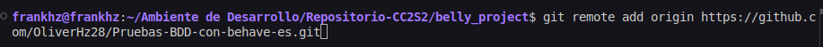
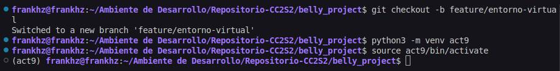
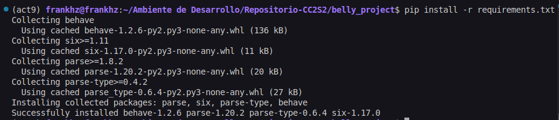
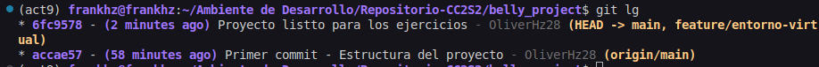

### Actividad: Pruebas BDD con behave en español

Este proyecto es un ejemplo de cómo utilizar **behave**, una herramienta para pruebas de desarrollo dirigido por comportamiento (Behavior-Driven Development - BDD) en Python, para escribir y ejecutar pruebas en español. Simula el comportamiento de un estómago (`Belly`) que gruñe o no en función de la cantidad de pepinos consumidos y el tiempo de espera.

### Tabla de contenidos

- [Requisitos previos](#requisitos-previos)
- [Estructura del proyecto](#estructura-del-proyecto)
- [Instalación](#instalación)
- [Ejecutar las pruebas](#ejecutar-las-pruebas)
- [Detalles del proyecto](#detalles-del-proyecto)
- [Referencias](#referencias)

### Requisitos previos

- **Python 3.6** o superior
- **pip** (gestor de paquetes de Python)

### Estructura del proyecto

El proyecto tiene la siguiente estructura de directorios:

```
.
├── features
│   ├── belly.feature
│   ├── environment.py
│   └── steps
│       └── steps.py
├── src
│   └── belly.py
└── README.md
```

- **features**: Contiene los archivos relacionados con Behave.
  - **belly.feature**: Archivo que describe las características y escenarios en lenguaje Gherkin.
  - **environment.py**: Archivo de configuración para inicializar el contexto de Behave.
  - **steps**: Carpeta que contiene las definiciones de los pasos.
    - **steps.py**: Implementación de los pasos definidos en `belly.feature`.
- **src**: Contiene el código fuente del proyecto.
  - **belly.py**: Implementación de la clase `Belly`.
- **README.md**: Este archivo de documentación.

#### Instalación

Sigue estos pasos para configurar el entorno y ejecutar el proyecto:

1. **Clona el repositorio o descarga el código fuente**:

   ```bash
   git clone https://github.com/tu_usuario/tu_proyecto.git
   cd tu_proyecto
   ```

    

    Creamos nuestro repositorio remoto.

2. **Crea y activa un entorno virtual llamado act9**:

   ```bash
   python3 -m venv act9
   source act9/bin/activate  # En Windows usa: act9\Scripts\activate

   ```
   Trabajamos en una rama secundaria

    


3. **Instala las dependencias necesarias**:

   Si tienes un archivo `requirements.txt`, instala las dependencias con:

   ```bash
   pip install -r requirements.txt
   ```

   Si no tienes un `requirements.txt`, instala Behave directamente:

   ```bash
   pip install behave
   ```

    

### Detalles del proyecto

#### Archivo `features/belly.feature`

Este archivo define las características y escenarios a probar utilizando el lenguaje Gherkin en español. Es importante especificar el idioma al inicio del archivo.

```gherkin
# language: es

Característica: Comportamiento del Estómago

  Escenario: Comer muchos pepinos y gruñir
    Dado que he comido 42 pepinos
    Cuando espero 2 horas
    Entonces mi estómago debería gruñir

  Escenario: Comer pocos pepinos y no gruñir
    Dado que he comido 10 pepinos
    Cuando espero 2 horas
    Entonces mi estómago no debería gruñir

  Escenario: Comer muchos pepinos y esperar menos de una hora
    Dado que he comido 50 pepinos
    Cuando espero media hora
    Entonces mi estómago no debería gruñir

  Escenario: Comer pepinos y esperar en minutos
    Dado que he comido 30 pepinos
    Cuando espero 90 minutos
    Entonces mi estómago debería gruñir

  Escenario: Comer pepinos y esperar en diferentes formatos
    Dado que he comido 25 pepinos
    Cuando espero "dos horas y treinta minutos"
    Entonces mi estómago debería gruñir
```

#### Archivo `features/steps/steps.py`

Contiene las definiciones de los pasos correspondientes a los escenarios en `belly.feature`. Se encarga de implementar la lógica detrás de cada paso.

```python
from behave import given, when, then
import re

# Función para convertir palabras numéricas a números
def convertir_palabra_a_numero(palabra):
    try:
        return int(palabra)
    except ValueError:
        numeros = {
            "cero": 0, "uno": 1, "una": 1, "dos": 2, "tres": 3, "cuatro": 4, "cinco": 5,
            "seis": 6, "siete": 7, "ocho": 8, "nueve": 9, "diez": 10, "once": 11,
            "doce": 12, "trece": 13, "catorce": 14, "quince": 15, "dieciséis": 16,
            "diecisiete": 17, "dieciocho": 18, "diecinueve": 19, "veinte": 20,
            "treinta": 30, "cuarenta": 40, "cincuenta": 50, "sesenta": 60, "setenta": 70,
            "ochenta": 80, "noventa": 90, "media": 0.5
        }
        return numeros.get(palabra.lower(), 0)

@given('que he comido {cukes:d} pepinos')
def step_given_eaten_cukes(context, cukes):
    context.belly.comer(cukes)

@when('espero {time_description}')
def step_when_wait_time_description(context, time_description):
    time_description = time_description.strip('"').lower()
    time_description = time_description.replace('y', ' ')
    time_description = time_description.strip()

    if time_description == 'media hora':
        total_time_in_hours = 0.5
    else:
        pattern = re.compile(r'(?:(\w+)\s*horas?)?\s*(?:(\w+)\s*minutos?)?')
        match = pattern.match(time_description)

        if match:
            hours_word = match.group(1) or "0"
            minutes_word = match.group(2) or "0"

            hours = convertir_palabra_a_numero(hours_word)
            minutes = convertir_palabra_a_numero(minutes_word)

            total_time_in_hours = hours + (minutes / 60)
        else:
            raise ValueError(f"No se pudo interpretar la descripción del tiempo: {time_description}")

    context.belly.esperar(total_time_in_hours)

@then('mi estómago debería gruñir')
def step_then_belly_should_growl(context):
    assert context.belly.esta_gruñendo(), "Se esperaba que el estómago gruñera, pero no lo hizo."

@then('mi estómago no debería gruñir')
def step_then_belly_should_not_growl(context):
    assert not context.belly.esta_gruñendo(), "Se esperaba que el estómago no gruñera, pero lo hizo."
```

#### Archivo `features/environment.py`

Inicializa el contexto antes de cada escenario, creando una nueva instancia de `Belly`.

```python
from src.belly import Belly

def before_scenario(context, scenario):
    context.belly = Belly()
```

#### Archivo `src/belly.py`

Implementa la lógica de la clase `Belly`, que simula el comportamiento del estómago.

```python
class Belly:
    def __init__(self):
        self.pepinos_comidos = 0
        self.tiempo_esperado = 0

    def comer(self, pepinos):
        self.pepinos_comidos += pepinos

    def esperar(self, tiempo_en_horas):
        self.tiempo_esperado += tiempo_en_horas

    def esta_gruñendo(self):
        # El estómago gruñe si ha esperado al menos 1.5 horas y ha comido más de 10 pepinos
        return self.tiempo_esperado >= 1.5 and self.pepinos_comidos > 10
```

---
#### Ejercicios

Presenta las respuestas de estos ejercicios utilizando la siguiente estructura de directorio **unificada** que incluye:

- **src**: Código fuente principal.  
- **features**: Escenarios BDD con Behave (incluye `belly.feature`, `steps` y `environment.py`).  
- **tests**: Pruebas unitarias con Pytest.  
- **requirements.txt**: Dependencias necesarias.  
- **.github/workflows (opcional)** o archivo `.gitlab-ci.yml` / `azure-pipelines.yml` para **CI/CD**.  

```
.
├── features
│   ├── belly.feature
│   ├── environment.py
│   └── steps
│       └── steps.py
├── src
│   ├── belly.py
│   ├── clock.py
│   └── __init__.py
├── tests
│   ├── test_belly.py
│   └── __init__.py
├── requirements.txt

```
Cuando termines **todos los ejercicios** (del 1 al 15, o los que hayas incluido en tu proyecto) y ejecutes tanto las pruebas **unitarias** (Pytest) como las **pruebas BDD** (Behave) dentro de tu pipeline de CI/CD (o localmente), la **salida final** que verás será algo parecido a esto:

1. **Salida de Pytest** mostrando:
   - Una lista de pruebas unitarias, cada una con su estado (`PASSED`, `FAILED`, etc.).
   - Un **resumen** con el número total de pruebas ejecutadas y cuántas pasaron o fallaron.
   - (Opcional) Un reporte de **cobertura de código** si usas `pytest-cov`.

   Por ejemplo, algo así en tu consola:
   ```
   ========================= test session starts =========================
   platform linux -- Python 3.9.10, pytest-7.3.1, py-1.11.0, pluggy-1.0.0
   rootdir: /home/runner/work/tu_proyecto/tu_proyecto
   plugins: cov-4.0.0
   collected 8 items

   tests/test_belly.py .........                                   [100%]

   ---------- coverage: platform linux, python 3.9.10 ----------
   Name                Stmts   Miss  Cover
   ---------------------------------------
   src/belly.py          45      2    95%
   src/clock.py           4      0   100%
   ---------------------------------------
   TOTAL                 49      2    96%

   ====================== 8 passed in 0.45s =====================
   ```

2. **Salida de Behave** mostrando:
   - La ejecución de cada **feature**, cada **escenario** y cada **step**.
   - Un **resumen final** con la cantidad de escenarios y pasos que pasaron o fallaron.
   
   Por ejemplo, en tu terminal:
   ```
   Feature: Comportamiento del Estómago (Belly)  # features/belly.feature
     Comer pepinos y esperar con horas, minutos y segundos
       Given que he comido 35
       When espero "1 hora y 30 minutos y 45 segundos"
       Then mi estómago debería gruñir ... PASSED

     Comer una cantidad fraccionaria de pepinos
       Given que he comido 0.5
       When espero "2 horas"
       Then mi estómago no debería gruñir ... PASSED

     Esperar usando horas en inglés
       Given que he comido 20
       When espero "two hours and thirty minutes"
       Then mi estómago debería gruñir ... PASSED

     Comer pepinos y esperar un tiempo aleatorio
       Given que he comido 25
       When espero "un tiempo aleatorio entre 1 y 3 horas"
       Then mi estómago debería gruñir ... PASSED

     Manejar una cantidad no válida de pepinos
       Given que he comido -5
       Then debería ocurrir un error de cantidad negativa. ... PASSED

     Comer 1000 pepinos y esperar 10 horas
       Given que he comido 1000
       When espero "10 horas"
       Then mi estómago debería gruñir ... PASSED

     Comer muchos pepinos y esperar el tiempo suficiente
       Given que he comido 15
       When espero "2 horas"
       Then mi estómago debería gruñir ... PASSED

     Saber cuántos pepinos puedo comer antes de gruñir
       Given que he comido 8
       When pregunto cuántos pepinos más puedo comer
       Then debería decirme que puedo comer 2 pepinos más ... PASSED


   1 feature passed, 8 scenarios passed, 0 failed, 0 skipped
   24 steps passed, 0 failed, 0 skipped
   ```

3. **Reporte y estado final en tu pipeline**:  
   - Si estás usando GitHub Actions, GitLab CI, Jenkins o cualquier otro, verás un **job de “build/test”** con un **estado “PASSED”** o “SUCCESS”.
   - Los **reportes** (JUnit, cobertura, etc.) quedarán **adjuntos** como “artifacts” o en la sección de reportes de tu plataforma.

En conjunto, la **salida final** refleja que:

- **Todas las pruebas unitarias** (TDD) han sido satisfactorias.  
- **Todos los escenarios BDD** (Behave) han concluido como `PASSED`.  
- Tu proyecto está **“verde”** y listo para ser desplegado o para continuar con la siguiente iteración.  

Ese **resultado verde** (todas las pruebas pasando) es el **objetivo final** de integrar todos los ejercicios en un flujo DevOps:  
- Validar la lógica básica con **Pytest**.  
- Validar el comportamiento de negocio con **Behave**.  
- Automatizarlo todo en un **pipeline** para tener feedback continuo y rápido.

Inicio de los ejercicios - en la rama `feature/entorno-virtual`



----
