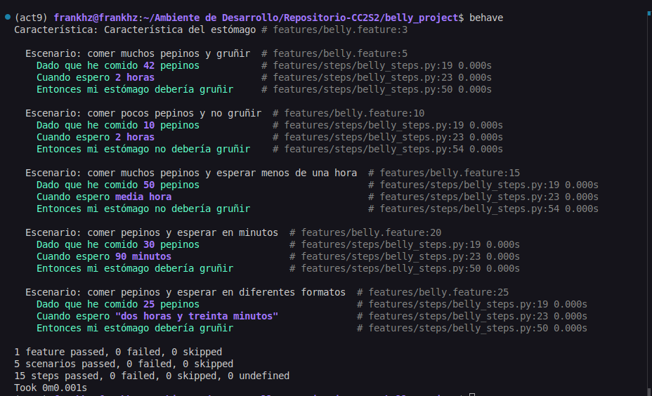

### Actividad: Pruebas BDD con behave en español

Este proyecto es un ejemplo de cómo utilizar **behave**, una herramienta para pruebas de desarrollo dirigido por comportamiento (Behavior-Driven Development - BDD) en Python, para escribir y ejecutar pruebas en español. Simula el comportamiento de un estómago (`Belly`) que gruñe o no en función de la cantidad de pepinos consumidos y el tiempo de espera.

### Tabla de contenidos

- [Requisitos previos](#requisitos-previos)
- [Estructura del proyecto](#estructura-del-proyecto)
- [Instalación](#instalación)
- [Ejecutar las pruebas](#ejecutar-las-pruebas)
- [Detalles del proyecto](#detalles-del-proyecto)
- [Referencias](#referencias)

### Requisitos previos

- **Python 3.6** o superior
- **pip** (gestor de paquetes de Python)

### Estructura del proyecto

El proyecto tiene la siguiente estructura de directorios:

```
.
├── features
│   ├── belly.feature
│   ├── environment.py
│   └── steps
│       └── steps.py
├── src
│   └── belly.py
└── README.md
```

- **features**: Contiene los archivos relacionados con Behave.
  - **belly.feature**: Archivo que describe las características y escenarios en lenguaje Gherkin.
  - **environment.py**: Archivo de configuración para inicializar el contexto de Behave.
  - **steps**: Carpeta que contiene las definiciones de los pasos.
    - **steps.py**: Implementación de los pasos definidos en `belly.feature`.
- **src**: Contiene el código fuente del proyecto.
  - **belly.py**: Implementación de la clase `Belly`.
- **README.md**: Este archivo de documentación.

#### Instalación

Sigue estos pasos para configurar el entorno y ejecutar el proyecto:

1. **Clona el repositorio o descarga el código fuente**:

   ```bash
   git clone https://github.com/tu_usuario/tu_proyecto.git
   cd tu_proyecto
   ```

    

    Creamos nuestro repositorio remoto.

2. **Crea y activa un entorno virtual llamado act9**:

   ```bash
   python3 -m venv act9
   source act9/bin/activate  # En Windows usa: act9\Scripts\activate

   ```
   Trabajamos en una rama secundaria

    


3. **Instala las dependencias necesarias**:

   Si tienes un archivo `requirements.txt`, instala las dependencias con:

   ```bash
   pip install -r requirements.txt
   ```

   Si no tienes un `requirements.txt`, instala Behave directamente:

   ```bash
   pip install behave
   ```

    

### Ejecutar las pruebas

Para ejecutar las pruebas, utiliza el comando:

```bash
behave
```



Este comando buscará automáticamente los archivos `.feature` dentro de la carpeta `features` y ejecutará los escenarios definidos.

### Detalles del proyecto