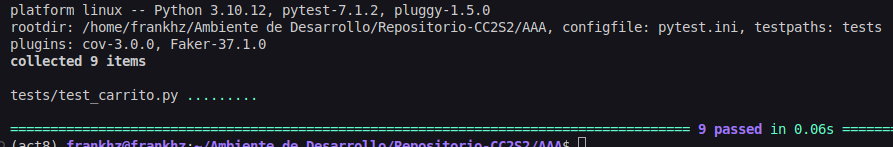
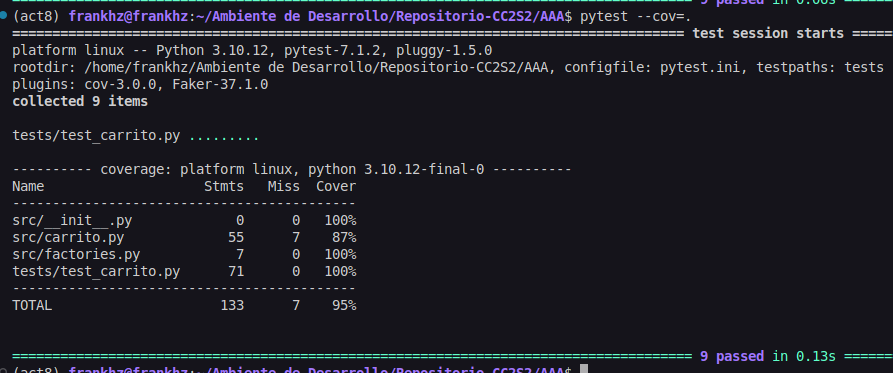
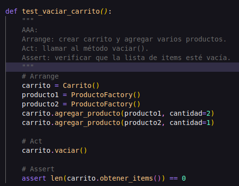
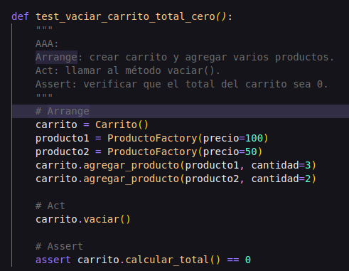
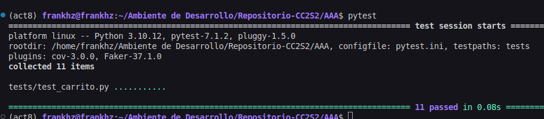
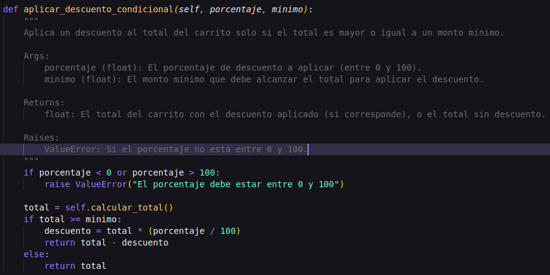
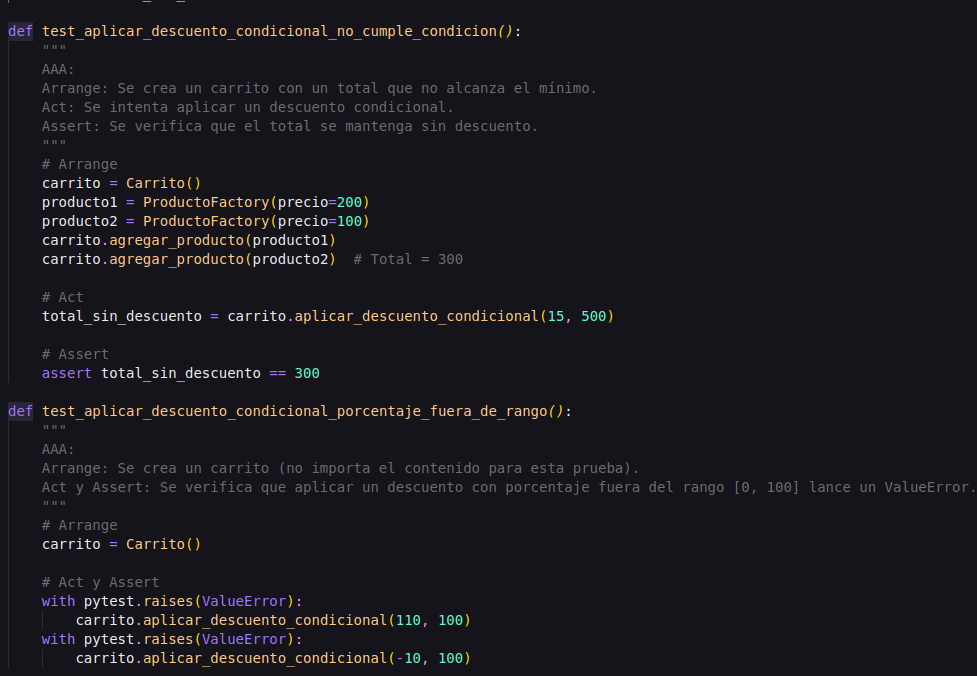
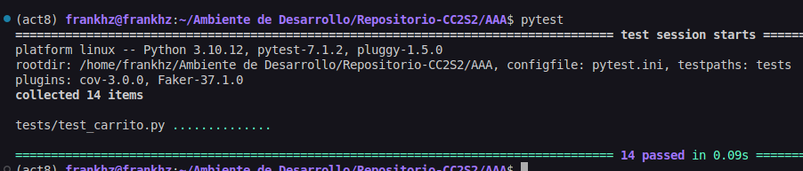

## Ejercicios

### Test de inicios 

*`pytestes`*

*`cov`*

### Ejercicio 1: Método para vaciar el carrito

**Objetivo:**  
Implementa en la clase `Carrito` un método llamado `vaciar()` que elimine todos los items del carrito. Luego, escribe pruebas siguiendo el patrón AAA para verificar que, al vaciar el carrito, la lista de items quede vacía y el total sea 0.

**Pistas:**
- Agrega el método `vaciar` en `src/carrito.py` que realice `self.items = []`.
- Crea pruebas en `tests/test_carrito.py` que agreguen varios productos, invoquen `vaciar()` y verifiquen que `obtener_items()` retorne una lista vacía y `calcular_total()` retorne 0.

 **Metodo `vaciar`**

 

**Pruebas - `test_vaciar_carrito()`**

**Pruebas - `test_vaciar_carrito_total_cero()`**

**`pytest`**

---
### Ejercicio 2: Descuento por compra mínima

**Objetivo:**  
Amplía la lógica del carrito para aplicar un descuento solo si el total supera un monto determinado. Por ejemplo, si el total es mayor a \$500, se aplica un 15% de descuento.

**Pistas:**
- Agrega un nuevo método, por ejemplo, `aplicar_descuento_condicional(porcentaje, minimo)` en la clase `Carrito` que primero verifique si `calcular_total() >= minimo`.  
- Si se cumple la condición, aplica el descuento; de lo contrario, retorna el total sin descuento.
- Escribe pruebas para ambos escenarios (condición cumplida y no cumplida).

 **Metodo `aplicar_descuento_condicional`**

 

**Pruebas - `test`**

**`pytest`**

---
