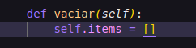
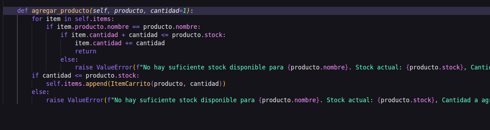
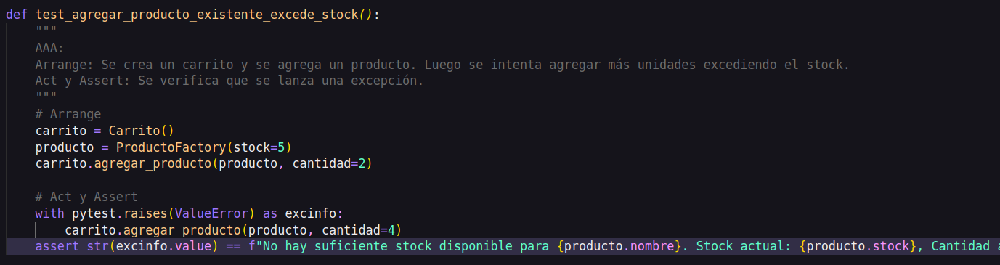
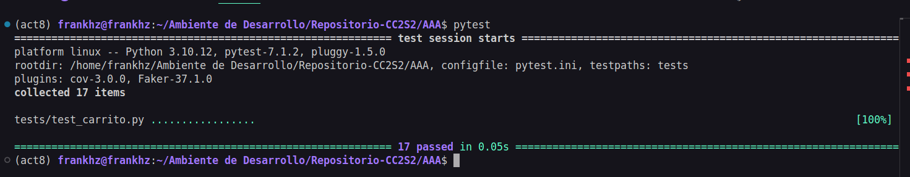
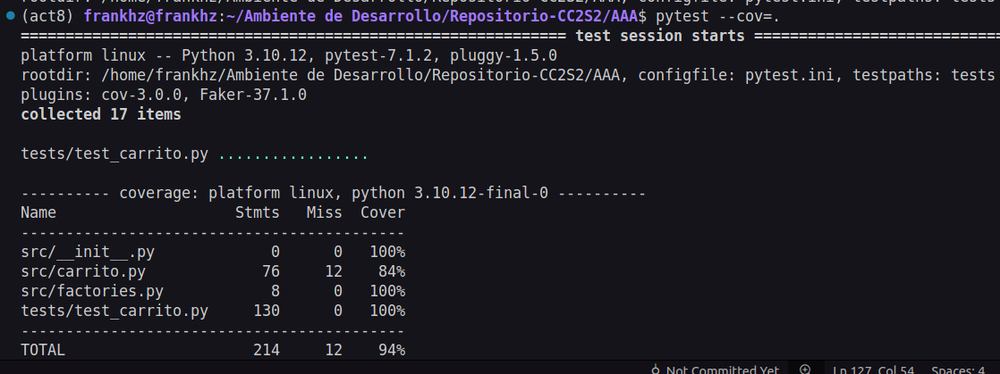
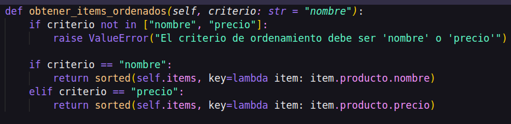
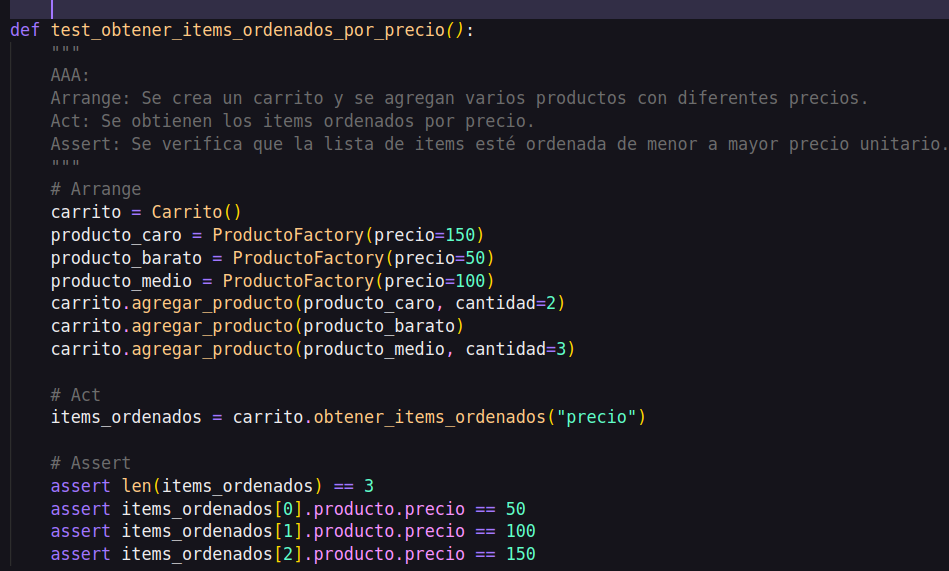
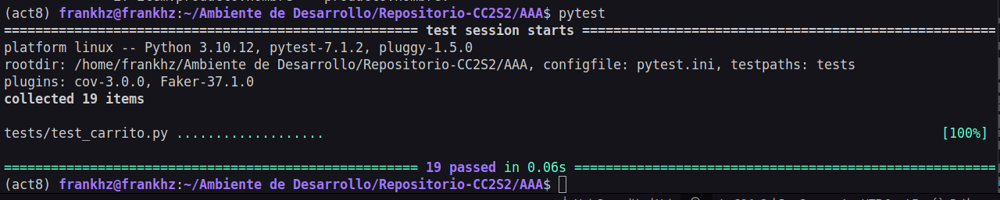
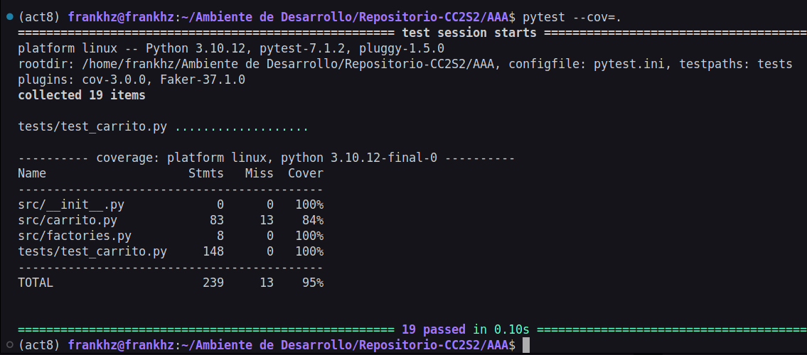

## Ejercicios

### Test de inicios 

*`pytestes`*

*`cov`*

### Ejercicio 1: Método para vaciar el carrito

**Objetivo:**  
Implementa en la clase `Carrito` un método llamado `vaciar()` que elimine todos los items del carrito. Luego, escribe pruebas siguiendo el patrón AAA para verificar que, al vaciar el carrito, la lista de items quede vacía y el total sea 0.

**Pistas:**
- Agrega el método `vaciar` en `src/carrito.py` que realice `self.items = []`.
- Crea pruebas en `tests/test_carrito.py` que agreguen varios productos, invoquen `vaciar()` y verifiquen que `obtener_items()` retorne una lista vacía y `calcular_total()` retorne 0.

 **Metodo `vaciar`**

 

**Pruebas - `test_vaciar_carrito()`**

**Pruebas - `test_vaciar_carrito_total_cero()`**

**`pytest`**

---
### Ejercicio 2: Descuento por compra mínima

**Objetivo:**  
Amplía la lógica del carrito para aplicar un descuento solo si el total supera un monto determinado. Por ejemplo, si el total es mayor a \$500, se aplica un 15% de descuento.

**Pistas:**
- Agrega un nuevo método, por ejemplo, `aplicar_descuento_condicional(porcentaje, minimo)` en la clase `Carrito` que primero verifique si `calcular_total() >= minimo`.  
- Si se cumple la condición, aplica el descuento; de lo contrario, retorna el total sin descuento.
- Escribe pruebas para ambos escenarios (condición cumplida y no cumplida).

 **Metodo `aplicar_descuento_condicional`**

 

**Pruebas - `test`**

**`pytest`**

---
### Ejercicio 3: Manejo de stock en producto

**Objetivo:**  
Modifica la clase `Producto` para que incluya un atributo `stock` (cantidad disponible). Luego, actualiza el método `agregar_producto` en `Carrito` para que verifique que no se agregue una cantidad mayor a la disponible en stock. Si se intenta agregar más, se debe lanzar una excepción.

**Pistas:**
- Modifica `Producto` en `src/carrito.py` añadiendo `self.stock = stock` en el constructor y actualiza la fábrica en `src/factories.py` para que genere un stock (por ejemplo, entre 1 y 100).
- En `Carrito.agregar_producto`, antes de agregar o incrementar la cantidad, verifica que la suma de cantidades en el carrito no supere el `stock` del producto.
- Escribe pruebas que verifiquen:
  - Se puede agregar un producto dentro del límite de stock.
  - Se lanza una excepción al intentar agregar más unidades de las disponibles.

 **Metodo `agregar_producto`**

 

**Pruebas - `test`**

**`pytest`**

**`cov`**

---

### Ejercicio 4: Ordenar items del carrito

**Objetivo:**  
Agrega un método en `Carrito` que devuelva la lista de items ordenados por un criterio (por ejemplo, por precio unitario o por nombre del producto).

**Pistas:**
- Crea un método `obtener_items_ordenados(criterio: str)` donde `criterio` pueda ser `"precio"` o `"nombre"`.
- Utiliza la función `sorted()` con una función lambda para ordenar según el criterio.
- Escribe pruebas que verifiquen que, al agregar varios productos, la lista devuelta esté ordenada correctamente según el criterio solicitado.

 **Metodo `obener_items_ordenados`**

 

**Pruebas - `test`**

**`pytest`**

**`cov`**

---