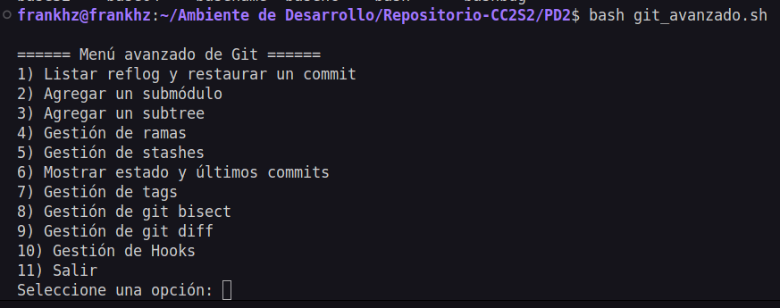
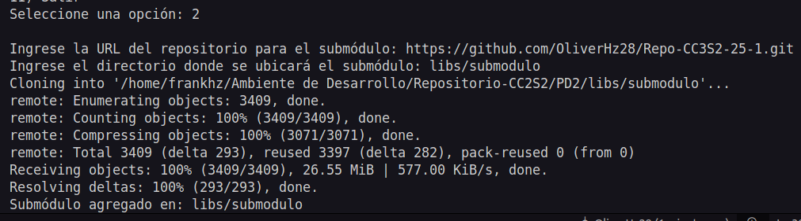
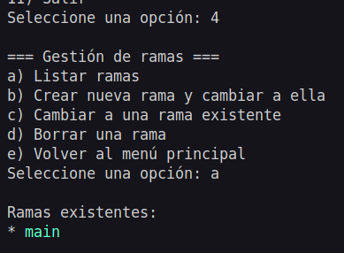
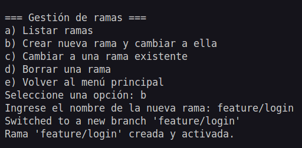
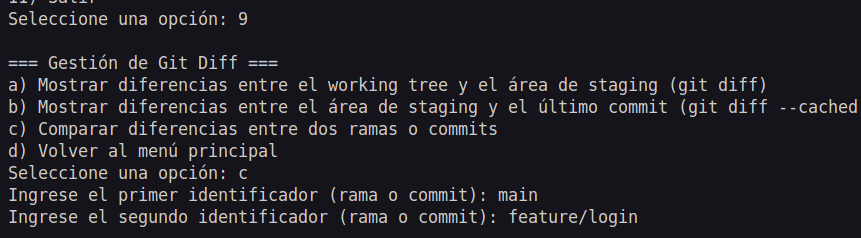
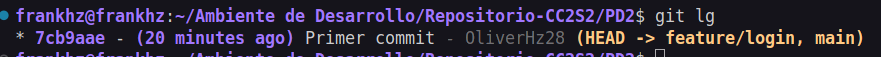
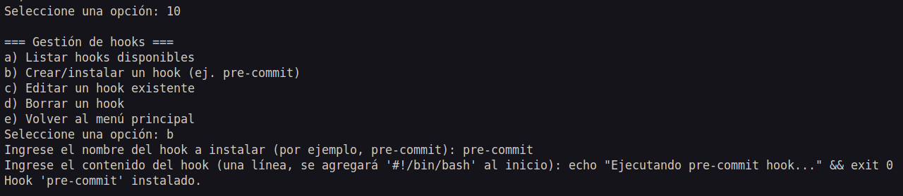
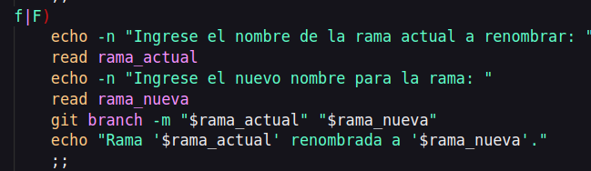
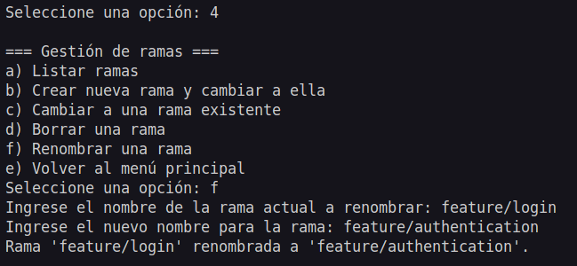
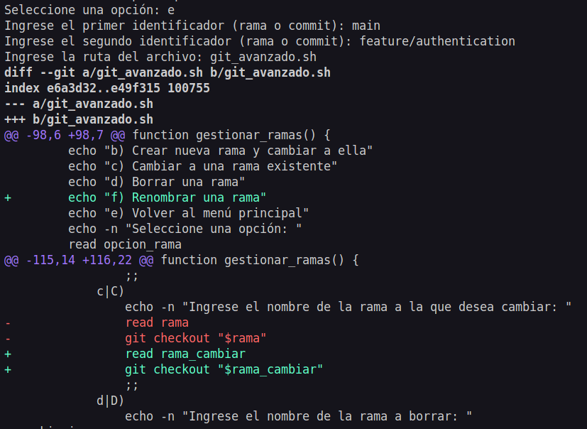

### Procedimiento de la actividad

1. **Inicio del script**

   Tras darle permisos de ejecución y ejecutar el script desde la raíz de un repositorio Git, se muestra el siguiente menú en la terminal:

   ```
   ====== Menú avanzado de Git ======
   1) Listar reflog y restaurar un commit
   2) Agregar un submódulo
   3) Agregar un subtree
   4) Gestión de ramas
   5) Gestión de stashes
   6) Mostrar estado y últimos commits
   7) Gestión de tags
   8) Gestión de Git Bisect
   9) Gestión de Git Diff
   10) Gestión de Hooks
   11) Salir
   Seleccione una opción:

**Ejecucion del script**    



2. **Opción: agregar un submódulo (Opción 2)**

   - **Usuario:** Ingresa `2` y presiona Enter.
   - El script pide:
     ```
     Ingrese la URL del repositorio para el submódulo:
     ```
   - **Usuario:** Escribe, por ejemplo:  
     `https://github.com/usuario/repositorio-submodulo.git`
   - El script solicita:
     ```
     Ingrese el directorio donde se ubicará el submódulo:
     ```
   - **Usuario:** Escribe, por ejemplo:  
     `libs/submodulo`
   - **Script:** Ejecuta:
     ```bash
     git submodule add https://github.com/usuario/repositorio-submodulo.git libs/submodulo
     git submodule update --init --recursive
     ```
   - **Salida esperada:**  
     El mensaje confirmando que el submódulo ha sido agregado:
     ```
     Submódulo agregado en: libs/submodulo
     ```

    **Agregar submodulo**

     

3. **Opción: Gestión de ramas (Opción 4)**

   - **Usuario:** Regresa al menú principal y escoge la opción `4`.
   - El script despliega un submenú:
     ```
     === Gestión de ramas ===
     a) Listar ramas
     b) Crear nueva rama y cambiar a ella
     c) Cambiar a una rama existente
     d) Borrar una rama
     e) Volver al menú principal
     Seleccione una opción:
     ```
   - **Ejemplo A: Listar ramas (Opción a)**
     - **Usuario:** Ingresa `a` y presiona Enter.
     - **Script:** Ejecuta `git branch` y muestra la lista de ramas:
       ```
         master
       * feature/nueva-funcionalidad
       ```

     **Visualizacion**

     

   - **Ejemplo B: Crear una nueva rama (Opción b)**
     - **Usuario:** Ingresa `b`, luego el script pregunta:
       ```
       Ingrese el nombre de la nueva rama:
       ```
     - **Usuario:** Escribe `feature/login`.
     - **Script:** Ejecuta `git checkout -b feature/login` y confirma:
       ```
       Rama 'feature/login' creada y activada.
       ```
     **Visualizacion**
     
     

4. **Opción: Gestión de git diff (Opción 9)**

   - **Usuario:** Selecciona la opción `9` del menú principal.
   - El submenú de diff se muestra:
     ```
     === Gestión de git diff ===
     a) Mostrar diferencias entre el working tree y el área de staging (git diff)
     b) Mostrar diferencias entre el área de staging y el último commit (git diff --cached)
     c) Comparar diferencias entre dos ramas o commits
     d) Volver al menú principal
     Seleccione una opción:
     ```
   - **Ejemplo:**  
     - **Usuario:** Ingresa `c` para comparar dos revisiones.  
       El script solicita:
       ```
       Ingrese el primer identificador (rama o commit):
       ```
     - **Usuario:** Escribe `master`.
     - El script luego pregunta:
       ```
       Ingrese el segundo identificador (rama o commit):
       ```
     - **Usuario:** Escribe `feature/login`.
     - **Script:** Ejecuta `git diff master feature/login` y muestra las diferencias entre ambas ramas en la terminal.

    **Visualizacion**
     
     

     No arroja nada debido a que no hay diferencias entre ambas ramas debido a que ambos apuntan al mismo commit

     **Visualizacion**
     
     

5. **Opción: Gestión de hooks (Opción 10)**

   - **Usuario:** Escoge la opción `10` para gestionar hooks.
   - Se despliega el submenú de hooks:
     ```
     === Gestión de hooks ===
     a) Listar hooks disponibles
     b) Crear/instalar un hook (ej. pre-commit)
     c) Editar un hook existente
     d) Borrar un hook
     e) Volver al menú principal
     Seleccione una opción:
     ```
   - **Ejemplo:** Crear un hook pre-commit.
     - **Usuario:** Ingresa `b`.
     - El script pregunta:
       ```
       Ingrese el nombre del hook a instalar (por ejemplo, pre-commit):
       ```
     - **Usuario:** Escribe `pre-commit`.
     - Luego el script solicita:
       ```
       Ingrese el contenido del hook (una línea, se agregará '#!/bin/bash' al inicio):
       ```
     - **Usuario:** Escribe una línea, por ejemplo:
       `echo "Ejecutando pre-commit hook..." && exit 0`
     - **Script:** Crea el archivo `.git/hooks/pre-commit`, lo hace ejecutable y confirma:
       ```
       Hook 'pre-commit' instalado.
       ```
        **Visualizacion**
     
        

6. **Finalizar la sesión**

   - **Usuario:** Cuando termine de utilizar las opciones deseadas, regresa al menú principal y selecciona `11` para salir:
     ```
     Saliendo del script.
 
    **Visualizacion**
     
     

### Preguntas

- **¿Qué diferencias observas en el historial del repositorio después de restaurar un commit mediante reflog?**

    > El historial principal no se altera, pero el reflog sí, pues registra la acción de restauración

- **¿Cuáles son las ventajas y desventajas de utilizar submódulos en comparación con subtrees?**

    >| Característica    | Submódulos                                  | Subtrees                                      |
    >| :---------------- | :------------------------------------------ | :-------------------------------------------- |
    >| **Ventajas** | - Proyectos separados, historiales propios | - Integración como subcarpeta, gestión sencilla |
    >|                   | - Mayor claridad en la propiedad del código. | - Historial unificado             |
    >| **Desventajas** | - Gestión más compleja  | - Mezcla de historiales (si no se gestiona bien). |
    >|                   | - Navegación entre proyectos puede ser menos fluida | - Mayor tamaño del repositorio principal       |
    >|                   |                                             | - Posibles conflictos al actualizar            |

- **¿Cómo impacta la creación y gestión de hooks en el flujo de trabajo y la calidad del código?**

    > Permite la automatizan tareas, aplicar políticas y mejorar la consistencia y calidad del código al prevenir o modificar acciones en puntos específicos del flujo de trabajo.

- **¿De qué manera el uso de `git bisect` puede acelerar la localización de un error introducido recientemente?**

    > Debido a que realiza una búsqueda binaria en el historial de commits, reduciendo drásticamente el número de commits que se necesita revisar manualmente para encontrar el commit que introdujo el error.

- **¿Qué desafíos podrías enfrentar al administrar ramas y stashes en un proyecto con múltiples colaboradores?**

    > Los desafios mas comunes serian los conflictos de merge frecuentes, pérdida o confusión de stashes si es que no se gestionan adecuadamente-

### Ejercicios 

1 . Extiende el menú de gestión de ramas para incluir la funcionalidad de renombrar ramas.

**Instrucciones:**

1. **Investiga** el comando `git branch -m` que permite renombrar una rama.
2. **Modifica** la función de "Gestión de ramas" para agregar una nueva opción (por ejemplo, "f) Renombrar una rama").
3. **Implementa** la lógica para solicitar al usuario el nombre de la rama actual y el nuevo nombre.
4. **Verifica** que, tras el cambio, la rama se renombre correctamente.  
   **Pista:** Considera cómo se comporta el cambio si la rama en uso es la que se desea renombrar.

**Ejemplo de salida esperada:**

```
Ingrese el nombre de la rama actual: feature/login
Ingrese el nuevo nombre para la rama: feature/authentication
Rama 'feature/login' renombrada a 'feature/authentication'
```

**Gestion de ramas modificada**




**Salida**


2 . Amplia la sección de "Gestión de git diff" para permitir ver las diferencias de un archivo específico entre dos commits o ramas.

**Instrucciones:**

1. **Investiga** cómo usar `git diff` con la opción `--` para especificar un archivo (por ejemplo, `git diff commit1 commit2 -- path/to/file`).
2. **Agrega** al submenú de diff una nueva opción (por ejemplo, "e) Comparar diferencias de un archivo específico").
3. **Solicita** al usuario ingresar dos identificadores (ramas o commits) y luego la ruta del archivo.
4. **Ejecuta** el comando `git diff` para mostrar únicamente las diferencias para ese archivo y presenta el resultado en pantalla.

**Ejemplo de salida esperada:**

```
Ingrese el primer identificador (rama o commit): master
Ingrese el segundo identificador (rama o commit): feature/login
Ingrese la ruta del archivo: src/app.js
[Mostrará el diff solo de 'src/app.js' entre las dos revisiones]
```

**Visualizacion**


